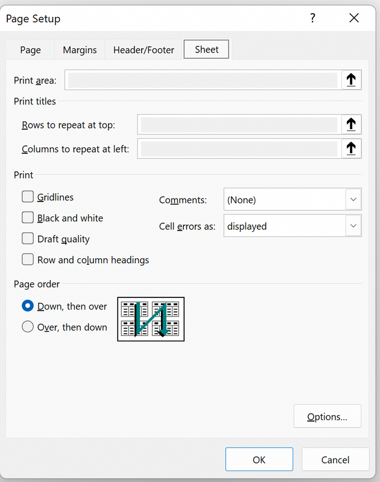
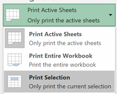
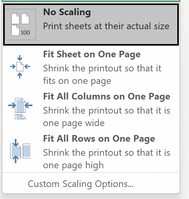

|Setting|Description|Example|
|---|---|---|
|Orientation|Orientation of the print - landscape, portrait||
|Paper Size|Size of the final print, not the paper size of the soft copy|- A4 - Legal|
|Page Range|- Print all - Print from `[start]` to `[end]`|- Print `All` - Print `[x]` - `[y]` `[odd pages/even pages]` - Print `[a]`,`[c]`,`[e]`|
|Copies|Number of copies||
|Collation|- Collated - Uncollated|- 1, 2, 3, 4, 5 - 1, 1, 1, 1, 1 - 2, 2, 2, 2, 2 - 3, 3, 3, 3, 3|
|Color/Grayscale|- Color - Grayscale||	
|Print Quality||- Economy (fastest) - Medium - High quality (slowest)|
|Paper Type||- Plain - Gloss|
|Double sided|double side printing included in some printers|double side printing has to be carried out manually in some printers|
|Borderless Printing|Some letterhead designs may only work with borderless printing||
|Watermark|A watermark can be added in the printer setting|Adding a watermark can prevent unauthorized duplicates|

### Printing Spreadsheets
1. Set Page Layout
    * Page Orientation, margin, scaling
2. Font-size
    * some fonts readable on screen may become too small to read in prints
3. Gridlines
    * Make sure you want to include or exclude gridlines

4. Print Selection
    * Active Sheets - only the selected sheet will be printed
    * Entire Workbook - All sheets will be printed, one sheet per page
    * Selected cells - Only a selected range of cells

:::note
Always try to use selected cells as excel usually print unnecessary cells taking up extra space in the paper
:::

5. Scaling
    * No Scaling
    * Fit Sheet on One Page
    * Fill All columns on one page (regardless of the rows)
    * Fit All rows on one page (regardless of the columns)

6. Paper Size
    * Make sure to select A4