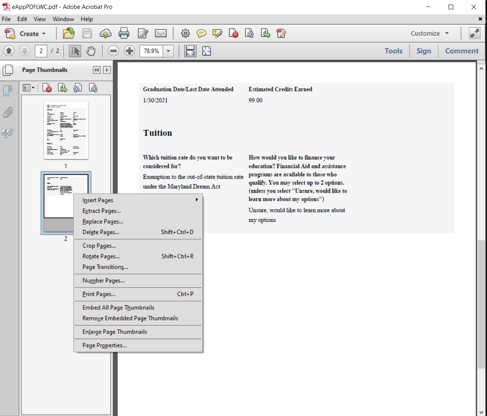
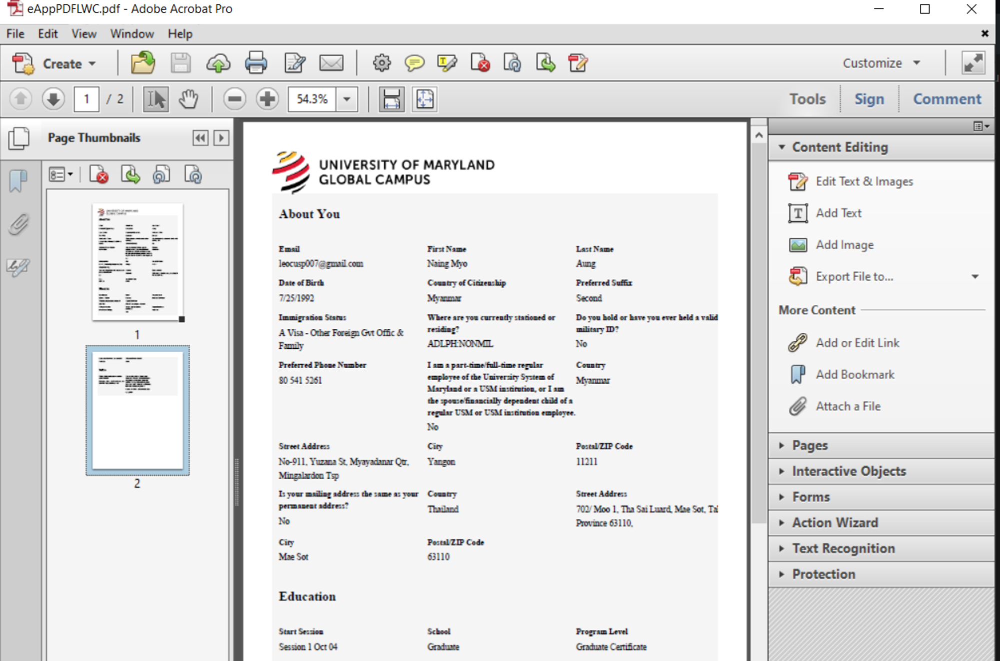

တစ်ရွက်စီဖြစ်နေသော PDF File များအား File တစ်ခုတည်းအဖြစ် ပေါင်းခြင်း PDF File အတွင်းရှိ File များအား Delete ပြုလုပ်ခြင်းနှင့် မိမိလိုအပ်သလို ပုံများနှင့် Digital Sign များအား Adobe PDF တွင် ထည့်သွင်းအသုံးပြုနိုင်ပါသည်။

### Inserting and Deleting Pages
PDF document ကို Adobe PDF ဖြင့်ဖွင့်ပါ။ ဘယ်ဘက်ခြမ်းတွင် Sidebar မြင်ရပါမယ်။ ပုံမှာပြထားတဲ့အတိုင်း Sidebar မတွေ့ရင် **View** ထဲက **Sidebar** ကိုရွေးပါ

စာမျက်နှာအသစ်တိုးဖို့အတွက် Sidebar မှာ Rightclick လုပ်ပြီး **Insert Pages** ကိုရွေးပါ

စာမျက်နှာဖျက်ဖို့အတွက် Sidebar မှာ ဖျက်မယ့်စာမျက်နှာကို Rightclick လုပ်ပြီး **Delete Pages** ကိုရွေးပါ

စာမျက်နှာတွေကို အလျားလိုက်-ဒေါင်လိုက် အပြန်အလှန်ပြောင်းလဲဖို့အတွက် **Rotate Pages** ကိုရွေးပါ

### Inserting/Editing Text and Images
PDF document ထဲကို စာသားထပ်တိုးချင်တာ၊ လက်မှတ်ထိုးသလိုမျိုး ပုံထပ်ထည့်ချင်တဲ့အခါ ညာဘက်အပေါ်နားက **Tools** ကိုရွေးပါ

စာသားထည့်ဖို့ **Add Text** ကိုရွေးပါ။ ထည့်ချင်တဲ့နေရာမှာ click နှိပ်ပြီးစာရိုက်ထည့်နိုင်ပါတယ်

ပုံထည့်ဖို့ **Add Image** ကိုရွေးပါ။ ထည့်ချင်တဲ့နေရာမှာ click နှိပ်ပါ

:::note
လက်မှတ်လိုပုံတွေထည့်ဖို့ဆိုရင် အဖြူရောင်နောက်ခံမပါတဲ့ *PNG* ဖိုင်ဖြစ်ဖို့လိုပါတယ်
:::

[မိမိထိုးမြဲလက်မှတ်ကိုအဖြူရောင်နောက်ခံဖျောက်ပြီး *PNG* ဖိုင်အဖြစ်ပြောင်းနည်း](/ehssg-it-orientation/creating-signature-images)

PDF ထဲက စာတွေပုံတွေကို click နှိပ်ပြီး select လုပ်လို့ရမှ Edit လုပ်လို့ရမှာဖြစ်ပါတယ်။ စာအုပ်ကို စကင်ဖတ်ထားတဲ့ PDF ဖိုင်တွေမှာ စာတွေပုံတွေကို select လုပ်လို့မရပါဘူး။ စာစီစာရိုက် software တွေကနေ PDF ကိုတိုက်ရိုက်ထုတ်ထားတဲ့အခါမှသာ Adobe PDF software ကနေ edit ပြန်ပြင်လို့ရမှာဖြစ်ပါတယ်

**Edit Text & images** ကိုနှိပ်ပြီး ခဏစောင့်လိုက်ရင် ပြင်ချင်တဲ့နေရာကို click နှိပ်ပြီး ပြင်နိုင်ပါတယ်