အွန်လိုင်းကနေ training ၊ workshop ၊ meeting တွေလုပ်တဲ့အခါ တက်ရောက်သူစာရင်းကောက်ယူနိုင်ဖို့ EHSSG Event Register ကိုအသုံးပြုနိုင်ပါတယ်

[ehssg.org/portal](https://ehssg.org/portal) ကိုသွားပါ

မိမိ username ၊ password တို့နဲ့ login ဝင်ပါ

Login ဝင်ပြီးပြီဆိုရင် `Tools/Event Registration` ကိုသွားပါ

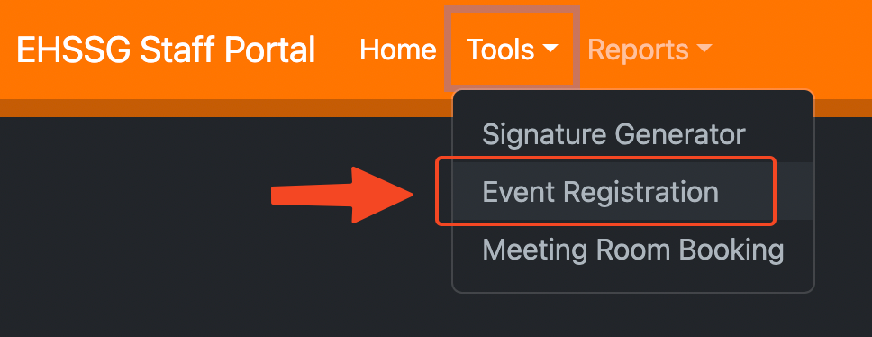

Event Registration စာမျက်နှာမှာ EHSSG က လတ်တလောပြုလုပ်ထားတဲ့ event တွေကိုမြင်ရမှာဖြစ်ပါတယ်။

## Event အသစ်ပြုလုပ်ခြင်း
`Add Event` ခလုတ်ကိုနှိပ်ပါ။

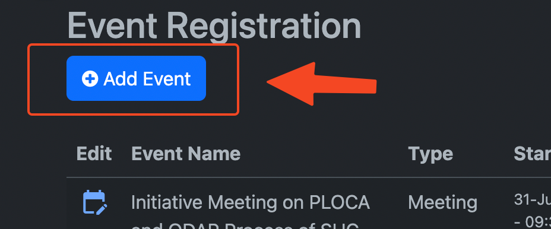

Event name မှာ ကိုယ်ပြုလုပ်လိုတဲ့ အစည်းအဝေး/သင်တန်းအမည်ရိုက်ထည့်ပါ။

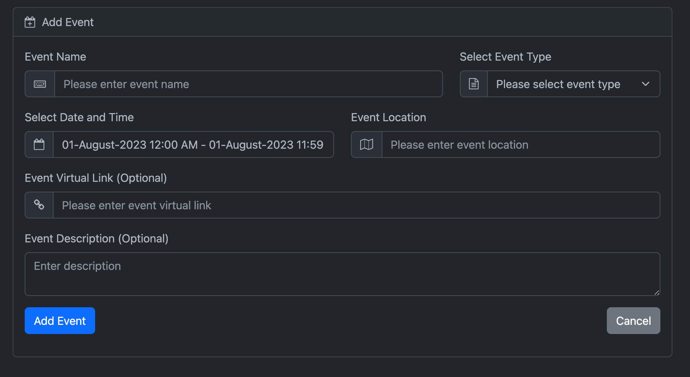

Event Type မှာ အမျိုးအစားရွေးချယ်ပါ။

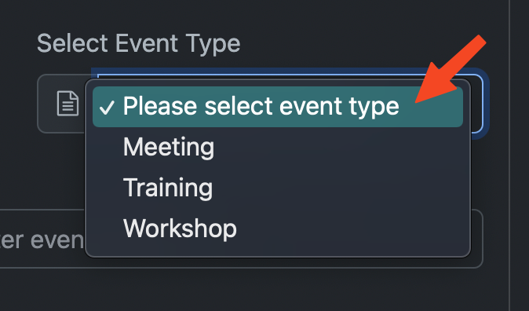

Date and Time မှာ စသည့်ရက်စွဲနှင့်အချိန်၊ ပြီးဆုံးသည့်ရက်စွဲနှင့်အချိန်ကို ရွေးချယ်ပါ။

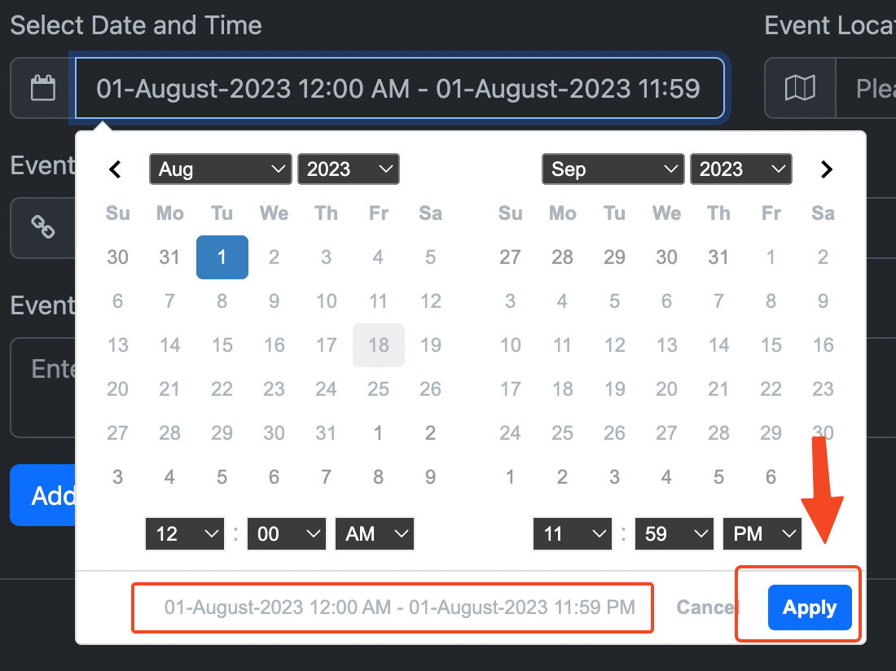

Event Location မှာ ကျင်းပသည့်နေရာထည့်သွင်းပါ။

Virtual Link မှာ အွန်လိုင်းကနေဝင်ရောက်နိုင်မည့် Zoom Link ဖြစ်စေ၊ Google Meet link ဖြစ်စေ ထည့်သွင်းပါ။ (Optional) ဖြစ်တာကြောင့် link မရှိလျှင်မထည့်သွင်းဘဲထားခဲ့နိုင်ပါတယ်။

Event Description မှာ event အကြောင်းအနည်းငယ်ထည့်သွင်းဖော်ပြနိုင်ပါတယ်။ (Option) မို့လို့ မထည့်ဘဲထားခဲ့လည်းရပါတယ်။

`Add Event` ခလုတ်ကိုနှိပ်ပါ။

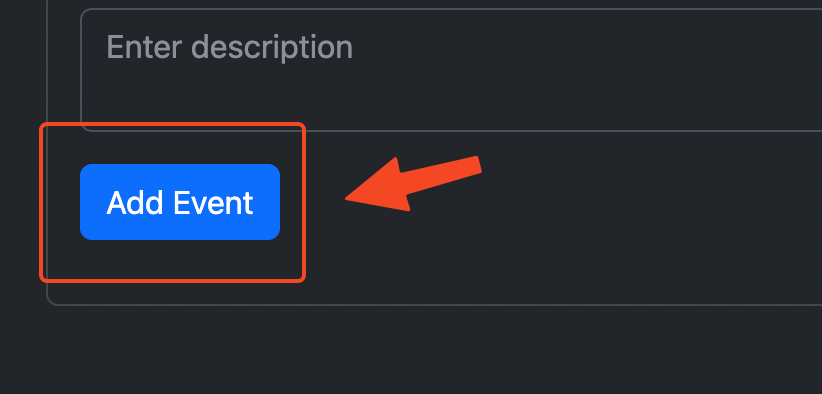

Event အသစ်ပြုလုပ်ခြင်းပြီးစီးသွားတဲ့အခါ မူလစာမျက်နှာကို ပြန်ရောက်လာပါမယ်။

## Event Table ဆိုင်ရာ column များ

Event Table မှာ EHSSG Staff တွေပြုလုပ်ထားတဲ့ event တွေမြင်ရမှာဖြစ်ပြီး table column တွေကတော့

### Edit

ကိုယ်ပြုလုပ်ထားတဲ့ event ကို Edit ပြုလုပ်ဖို့ဖြစ်ပါတယ်။ ကိုယ့် event မှာပဲ Edit ခလုတ်ပေါ်မှာဖြစ်ပြီး တခြားသူလုပ်ထားတဲ့ event မှာတော့ Edit ခလုတ်ပေါ်မှာမဟုတ်ပါဘူး။

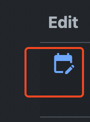

### Event Name | Type | Starts: | Ends: | Location

ဒီ Column တွေကတော့ event ပြုလုပ်ခဲ့စဉ်က ထည့်သွင်းခဲ့တဲ့အချက်အလက်တွေအတိုင်း ဖော်ပြပေးမှာဖြစ်ပါတယ်။

### Public Link

EHSSG Staff မဟုတ်တဲ့သူတွေ တက်ရောက်စာရင်းဝင်ဖြည့်ဖို့ စာမျက်နှာဖြစ်ပါတယ်။ Public Link ခလုတ်ကိုနှိပ်လိုက်ရင် New tab တစ်ခုပွင့်လာပြီး တက်ရောက်သူစာရင်းကို မိမိကိုယ်တိုင်လည်း ဝင်ဖြည့်ပေးနိုင်ပါတယ်။

### Copy link

Public Link ကို Copy ယူဖို့ခလုတ်ဖြစ်ပါတယ်။ ခလုတ်ကိုနှိပ်လိုက်တဲ့အခါ `Url copied to clipboard.` ဆိုတဲ့ message ပွင့်လာပါလိမ့်မယ်။ ကိုယ်နှစ်သက်ရာ messenger ၊ email စတာတွေမှာ သွား paste လုပ်လို့ရပါပြီ။

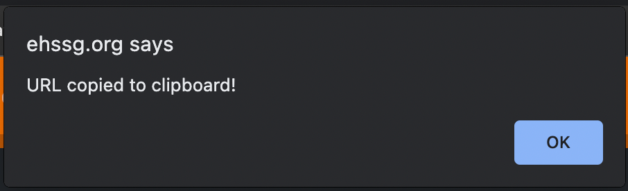

### View Attendance

တက်ရောက်သူစာရင်း ဝင်ကြည့်ဖို့စာမျက်နှာဖြစ်ပါတယ်။ `Edit` စာမျက်နှာလိုပဲ `View Attendance` စာမျက်နှာဟာ event လုပ်ထားတဲ့သူရဲ့ account မှာပဲ ဝင်ကြည့်လို့ရမှာဖြစ်ပါတယ်။

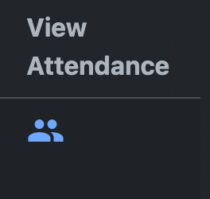

:::note
တခြားသူလုပ်ထားတဲ့ event တွေမှာ `View Attendance` စာမျက်နှာကိုသွားလို့ရမှာမဟုတ်ပါဘူး
:::

## တက်ရောက်သူစာရင်းကို View Attendance စာမျက်နှာတွင် ကြည့်ရှုခြင်း

`View Attendance` စာမျက်နှာကိုရောက်တဲ့အခါ တက်ရောက်သူစာရင်းကို table နဲ့မြင်ရမှာဖြစ်ပါတယ်။

Event တက်ရောက်သူထဲမှာ လူမျိုးစုံပါနိုင်တာကြောင့် မိမိအချက်အလက်တွေကို ပြည့်စုံအောင်ထည့်နိုင်တဲ့သူရှိသလို အချက်အလက်မစုံတဲ့သူ၊ နှစ်ခါပြန်ထည့်မိတဲ့သူတွေလည်း ရှိနိုင်ပါတယ်။ အင်တာနက်မကောင်းလို့ဖြစ်စေ၊ မထည့်တတ်လို့ဖြစ်စေ အကြောင်းအမျိုးမျိုးကြောင့် မထည့်နိုင်တဲ့သူတွေလည်းရှိနိုင်ပါတယ်။

အဲဒီအခါ `Add Attendee Manually` ခလုတ်ကိုနှိပ်ပြီး တစ်ယောက်ချင်းထပ်မံထည့်သွင်းနိုင်ပါတယ်။

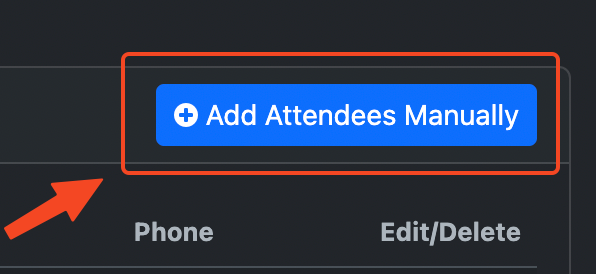

### တက်ရောက်သူအချက်အလက်ပြင်ဆင်ခြင်း၊ ဖျက်ခြင်း

တက်ရောက်သူတိုင်းရဲ့ ညာဘက်အစွန်မှာ Edit/ Delete ခလုတ်ရှိပါတယ်။ ပြင်ချင်တဲ့အချက်အလက်တွေကို `Edit` ခလုတ်ကနေဝင်ပြင်နိုင်ပြီး နှစ်ခါဖြည့်မိလို့ဖျက်ရင်လျှင် `Delete` ခလုတ်နဲ့ဖျက်နိုင်ပါတယ်။

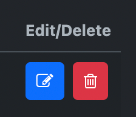

### တက်ရောက်သူစာရင်း download ရယူခြင်း

event တက်ရောက်သူစာရင်းရဲ့အောက်ဆုံးမှာ `Download PDF` နဲ့ `Download CSV` ခလုတ်တွေရှိပါတယ်။

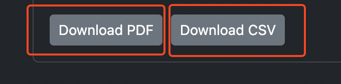

`Download PDF` က PDF file ရယူဖို့ဖြစ်ပြီး `Download CSV` က Microsoft Excel, Google Sheet စတဲ့ spreadsheet application တွေနဲ့ အသုံးပြုနိုင်တဲ့ CSV file ရယူဖို့ဖြစ်ပါတယ်။

## Event ဖျက်ခြင်း

Event တွေ မလိုအပ်တော့တဲ့အခါ၊ မှားယွင်းပြုလုပ်မိတဲ့အခါ ပြန်ဖျက်နိုင်ပါတယ်။

Event table ရဲ့ ဘယ်ဘက်အစွန်က `Edit` ခလုတ်ကိုနှိပ်ပါ။

`Edit Event` စာမျက်နှာရောက်ရင် `Delete Event` ခလုတ်ကိုနှိပ်ပါ။

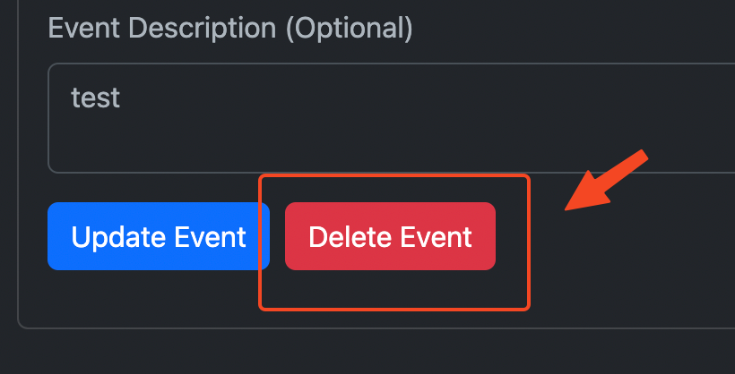

`Event ကိုဖျက်ရန် သေချာပါသလား? Event ဖျက်လိုက်လျှင် တက်ရောက်သူအချက်အလက်များပါ အလိုအလျောက်ပျက်သွားမည်ဖြစ်ပါသည်။` ဆိုတဲ့ alert message ပေါ်လာပါလိမ့်မယ်။

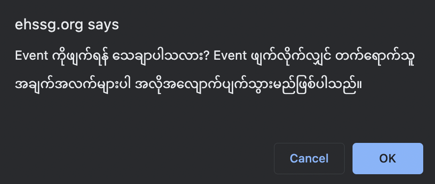

Event တစ်ခုကိုဖျက်လိုက်တာနှင့် အဲဒီ event အတွက်ဖြည့်ထားတဲ့ တက်ရောက်သူစာရင်းတွေပါ အလိုအလျောက်ပျက်သွားမယ်လို့ ဆိုလိုတာဖြစ်ပါတယ်။ data တွေဟာ ဖျက်ပြီးသွားလျှင် ပြန်ယူလို့မရနိုင်တော့တဲ့အတွက် မဖျက်ခင်မှာသေချာအောင်ရွေးချယ်ဖို့လိုပါတယ်။

သေချာပြီဆိုလျှင် `OK` နှိပ်ပြီး ဖျက်လိုက်လို့ရပါပြီ။