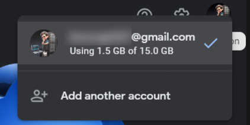

EHSSG ရုံးသုံးကွန်ပြူတာတွေမှာ Google Drive Client ကိုအဆင်သင့်ထည့်ပေးထားပါတယ်။ သက်ဆိုင်ရာဌာနရဲ့ Google Drive account ကို မိမိကွန်ပြူတာမှာ login ဝင်ထားဖို့လိုပါတယ်။ လုပ်ငန်းနဲ့ပတ်သက်တဲ့အရေးကြီး document တွေကို Google Drive မှာသိမ်းခြင်းအားဖြင့် အကြောင်းအမျိုးမျိုးကြောင့် ကွန်ပြူတာပျက်စီးပျောက်ဆုံးတဲ့အခါမျိုးမှာ အခြားကွန်ပြူတာတွေကနေ Google Drive ကိုပြန်ဝင်သုံးလို့ရနိုင်မှာဖြစ်ပါတယ်။

## Google Account Login
Google Desktop Client မသုံးမီ မိမိသက်ဆိုင်ရာဌာန Google Account ကို Browser မှာအရင်ဆုံး Login ဝင်ထားလိုပါတယ်။ ဌာနဆိုင်ရာ account ဖြစ်တဲ့အတွက် သက်ဆိုင်ရာ မန်နေဂျာများဆီက Username နှင့် Password တောင်းယူနိုင်ပါတယ်။

ကွန်ပြူတာက ဘရောက်ဇာကိုဖွင့်ပါ

Google login ဝင်ဖို့ https://accounts.google.com သို့သွားပါ။ Google login မဝင်ရသေးရင် Email ထည့်ပေးရမှာဖြစ်ပြီး ဝင်ထားပြီးသားဆိုရင် မိမိ profile icon ပေါ်နေပါလိမ့်မယ်

Login မဝင်ရသေးဘူးဆိုရင် **Email** နဲ့ **Password** ကိုဖြည့်ပါ။ Authentication code တောင်းတဲ့အခါမှာ သက်ဆိုင်ရာဌာနမန်နေဂျာထံမှာ authentication code တောင်းယူပါ။

account ဝင်ထားပြီးသားဖြစ်နေရင် **Add another account** ကိုနှိပ်ပါ။ Email နဲ့ Password ထည့်သွင်းပါ

ဘရောက်ဇာမှာ ဝင်ပြီးသွားရင် ကွန်ပြူတာထဲက Google Drive client မှာ ထပ်ဝင်ပေးရပါမယ်။ *Start* ထဲမှာ Google Drive လို့ရိုက်ထည့်ပြီး Google Drive application ကိုရွေးပါ

Google Drive ပွင့်လာပြီး Account မဝင်ရသေးရင် **Get Started** လို့မြင်ရပါမယ်။ **Get Started** ကိုနှိပ်ပါ

Sign in to get started စာမျက်နှာမှာ **Sign in** ကိုနှိပ်ပါ

Sign in နှိပ်လိုက်ရင် ဘရောက်ဇာပွင့်လာပါမယ်။ အစောပိုင်းတုန်းက ဘရောက်ဇာမှာ Google account ဝင်ထားပြီးသားဆိုရင် ရွေးလိုက်ရုံပါပဲ။ ဝင်ထားလက်စ account မဟုတ်ဘဲ နောက်ထပ် account တစ်ခုထပ်ဝင်ချင်တယ်ဆိုရင် **Use another account** ကိုနှိပ်ပါ

ဒီအကောင့်ကို Google Drive မှာ sign in ဝင်ချင်လားမေးရင် **Sign in** ကိုနှိပ်ပါ

Login ဝင်တာအဆင်ပြေတယ်ဆိုရင် အခုလိုမြင်ရပါမယ်

ပြီးရင်ဘယ် folder နဲ့ sync လုပ်မလဲမေးရင် **Skip** နှိပ်ပါ

Google Photo စာမျက်နှာမှာ **Got it** နှိပ်ပါ

Backup Google Photo မှာလည်း **Skip** ထပ်နှိပ်ပါ

ပြီးရင် **Next** နှိပ်ပါ။

**Open Drive** ကိုနှိပ်ပါ

Computer ရဲ့ This PC အောက်မှာ Google Drive icon တစ်ခုပေါ်လာပြီး အထဲကဖိုင်တွေကိုစတင်အသုံးပြုနိုင်ပါပြီ

### Add another account
ဌာနဆိုင်ရာ Google account အပြင် အခြား Google account ကိုပါသွင်းထားချင်တယ်ဆိုရင် Task Bar ထဲက Google Drive icon ကိုနှိပ်ပါ။ *Settings* ထဲက **Preferences** ကိုသွားပါ

Google Drive application ပွင့်လာရင် **Add Another Account** ကိုနှိပ်ပါ

ထပ်ထည့်ချင်တဲ့ account ကိုရွေးပါ။ Sign in စာမျက်နှာပွင့်လာရင် **Sign in** နှိပ်ပါ

Google Drive login အောင်မြင်ကြောင်း message တွေ့ရပါမယ်။ This PC ထဲမှာလည်း နောက်ထပ် Drive တစ်ခုထပ်တိုးလာတာတွေ့ရမှာဖြစ်ပါတယ်

