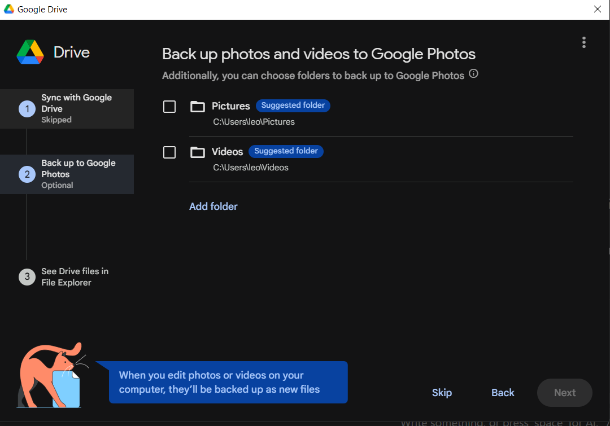
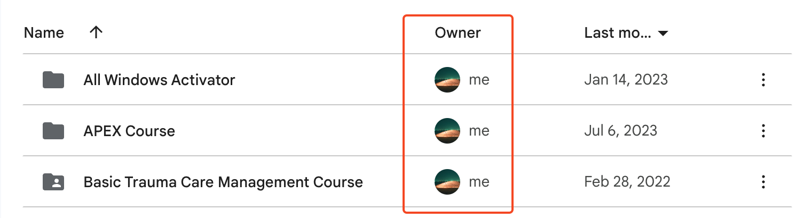

EHSSG ရုံးသုံးကွန်ပြူတာတွေမှာ Google Drive Client ကိုအဆင်သင့်ထည့်ပေးထားပါတယ်။ သက်ဆိုင်ရာဌာနရဲ့ Google Drive account ကို မိမိကွန်ပြူတာမှာ login ဝင်ထားဖို့လိုပါတယ်။ လုပ်ငန်းနဲ့ပတ်သက်တဲ့အရေးကြီး document တွေကို Google Drive မှာသိမ်းခြင်းအားဖြင့် အကြောင်းအမျိုးမျိုးကြောင့် ကွန်ပြူတာပျက်စီးပျောက်ဆုံးတဲ့အခါမျိုးမှာ အခြားကွန်ပြူတာတွေကနေ Google Drive ကိုပြန်ဝင်သုံးလို့ရနိုင်မှာဖြစ်ပါတယ်။

## Google Account Login
Google Desktop Client မသုံးမီ မိမိသက်ဆိုင်ရာဌာန Google Account ကို Browser မှာအရင်ဆုံး Login ဝင်ထားလိုပါတယ်။ ဌာနဆိုင်ရာ account ဖြစ်တဲ့အတွက် သက်ဆိုင်ရာ မန်နေဂျာများဆီက Username နှင့် Password တောင်းယူနိုင်ပါတယ်။

ကွန်ပြူတာက ဘရောက်ဇာကိုဖွင့်ပါ

Google login ဝင်ဖို့ https://accounts.google.com သို့သွားပါ။ Google login မဝင်ရသေးရင် Email ထည့်ပေးရမှာဖြစ်ပြီး ဝင်ထားပြီးသားဆိုရင် မိမိ profile icon ပေါ်နေပါလိမ့်မယ်

Login မဝင်ရသေးဘူးဆိုရင် **Email** နဲ့ **Password** ကိုဖြည့်ပါ။ Authentication code တောင်းတဲ့အခါမှာ သက်ဆိုင်ရာဌာနမန်နေဂျာထံမှာ authentication code တောင်းယူပါ။

account ဝင်ထားပြီးသားဖြစ်နေရင် **Add another account** ကိုနှိပ်ပါ။ Email နဲ့ Password ထည့်သွင်းပါ

ဘရောက်ဇာမှာ ဝင်ပြီးသွားရင် ကွန်ပြူတာထဲက Google Drive client မှာ ထပ်ဝင်ပေးရပါမယ်။ *Start* ထဲမှာ Google Drive လို့ရိုက်ထည့်ပြီး Google Drive application ကိုရွေးပါ

Google Drive ပွင့်လာပြီး Account မဝင်ရသေးရင် **Get Started** လို့မြင်ရပါမယ်။ **Get Started** ကိုနှိပ်ပါ

Sign in to get started စာမျက်နှာမှာ **Sign in** ကိုနှိပ်ပါ

Sign in နှိပ်လိုက်ရင် ဘရောက်ဇာပွင့်လာပါမယ်။ အစောပိုင်းတုန်းက ဘရောက်ဇာမှာ Google account ဝင်ထားပြီးသားဆိုရင် ရွေးလိုက်ရုံပါပဲ။ ဝင်ထားလက်စ account မဟုတ်ဘဲ နောက်ထပ် account တစ်ခုထပ်ဝင်ချင်တယ်ဆိုရင် **Use another account** ကိုနှိပ်ပါ

ဒီအကောင့်ကို Google Drive မှာ sign in ဝင်ချင်လားမေးရင် **Sign in** ကိုနှိပ်ပါ

Login ဝင်တာအဆင်ပြေတယ်ဆိုရင် အခုလိုမြင်ရပါမယ်

ပြီးရင်ဘယ် folder နဲ့ sync လုပ်မလဲမေးရင် **Skip** နှိပ်ပါ

Google Photo စာမျက်နှာမှာ **Got it** နှိပ်ပါ

Backup Google Photo မှာလည်း **Skip** ထပ်နှိပ်ပါ

ပြီးရင် **Next** နှိပ်ပါ။

**Open Drive** ကိုနှိပ်ပါ

Computer ရဲ့ This PC အောက်မှာ Google Drive icon တစ်ခုပေါ်လာပြီး အထဲကဖိုင်တွေကိုစတင်အသုံးပြုနိုင်ပါပြီ

### Add another account
ဌာနဆိုင်ရာ Google account အပြင် အခြား Google account ကိုပါသွင်းထားချင်တယ်ဆိုရင် Task Bar ထဲက Google Drive icon ကိုနှိပ်ပါ။ *Settings* ထဲက **Preferences** ကိုသွားပါ

Google Drive application ပွင့်လာရင် **Add Another Account** ကိုနှိပ်ပါ

ထပ်ထည့်ချင်တဲ့ account ကိုရွေးပါ။ Sign in စာမျက်နှာပွင့်လာရင် **Sign in** နှိပ်ပါ

Google Drive login အောင်မြင်ကြောင်း message တွေ့ရပါမယ်။ This PC ထဲမှာလည်း နောက်ထပ် Drive တစ်ခုထပ်တိုးလာတာတွေ့ရမှာဖြစ်ပါတယ်

## How to transfer ownership

Google Drive တစ်ခုကို share လုပ်ပြီးသုံးကြတဲ့အခါ ဖိုင်သိမ်းတဲ့နေရာဟာ ကိုယ့်ရဲ့ Drive မဟုတ်ပေမယ့်လည်း file owner နေရာမှာ ကိုယ်ဖြစ်နေလျှင် ကိုယ့်ရဲ့ personal Google Drive space ထဲက လာနုတ်ယူပါတယ်။
Word, Excel တို့နဲ့ဖွင့်ရတဲ့ ဖိုင်တွေကြောင့် personal Google Drive space ထိတာ မသိသာပေမယ့် Scan လုပ်ထားတဲ့ ဖိုင်တွေအသိမ်းများလာတဲ့အခါ personal space ပြည့်လာတတ်ပါတယ်။
ဒါကြောင့် Shared drive ထဲက ကိုယ်ပိုင်ဖိုင်တွေကို တခြားသူဆီလွှဲပြောင်းပေးဖို့လိုပါတယ်။

### Who is the Owner?

[`https://drive.google.com`](https://drive.google.com) ကိုသွားပါ။

Shared လုပ်ပြီးသုံးနေတဲ့ folder ကို အရင်ဆုံးသွားပါ။ ပုံသေအားဖြင့် Grid Layout နဲ့ မြင်ရတတ်ပါတယ်။

Grid Layout မှာ ownership ကို အလွယ်တကူမမြင်ရတာကြောင့် List Layout နဲ့ခေါ်ကြည့်ဖို့လိုပါတယ်။

List Layout ခေါ်ကြည့်ဖို့ ပုံမှာပြထားတဲ့ ခလုတ်ကိုနှိပ်ပြီး ကြည့်နိုင်ပါတယ်။

List Layout နှင့်ခေါ်ကြည့်လိုက်လျှင်တော့ Owner ဘယ်သူလဲဆိုတာ မြင်ရမှာဖြစ်ပါတယ်။

Owner မှာ `me` ပြနေတာတွေဟာ ကိုယ့်အကောင့်နဲ့ create လုပ်ထားတဲ့ file တွေ၊ folder တွေဖြစ်ပါတယ်။ ဒီထဲက file size ကြီးတာတွေကို ownership transfer လုပ်လိုက်ရင် personal space ထဲက သိသိသာသာလျော့သွားမှာဖြစ်ပါတယ်။

ဥပမာအားဖြင့် ဓါတ်ပုံတွေ၊ scan ဖတ်ထားတဲ့ PDF ဖိုင်တွေ၊ အသံဖိုင်၊ ဗီဒီယိုဖိုင်တွေဟာ file size ကြီးတတ်တာကြောင့် အဲဒီဖိုင်တွေကို transfer ownership လုပ်ပေးဖို့လိုပါတယ်။

### Transfer File

ownership လွှဲချင်တဲ့ ဖိုင်ကို Right Click နှိပ်ပါ။

`Share` → `Share` ကိုသွားပါ။

ဒီဖိုင်ကို access ရနေတဲ့ user စာရင်းပေါ်လာမှာဖြစ်ပါတယ်။ ကိုယ့်အကောင့်က `Owner` လို့ပြနေပါမယ်။

ownership လွှဲပေးချင်တဲ့အကောင့်ရဲ့ ညာဘက်က dropdown ကိုနှိပ်ပြီး `Transfer Ownership` ရွေးပေးပါ။

Transfer ownership? confirm ပေါ်လာရင် `Send Invitation` ခလုတ်ကိုနှိပ်ပါ။

`Invitation Sent` ဆိုတဲ့ message ပေါ်လာရင် ကိုယ့်ဘက်က transfer ownership လုပ်တဲ့အပိုင်းပြီးသွားပါပြီ။ အထက်ပါအဆင့်တွေအတိုင်း file size ကြီးတာတွေကို Transfer ownership လုပ်ပေးသွားဖို့လိုပါတယ်။

လက်ခံရရှိတဲ့ အကောင့်ဘက်ကနေ `Accept` ခလုတ်ကိုနှိပ်ပေးပြီးတဲ့အခါမှာတော့ မိမိ personal space ထဲမှာ နေရာလွတ်တွေပြန်ရလာမှာဖြစ်ပါတယ်။ လက်ခံရရှိတဲ့အကောင့်ကို `Accept` နှိပ်ပြီးလက်ခံယူပေးဖို့ သတိပေးဖို့လိုပါတယ်။