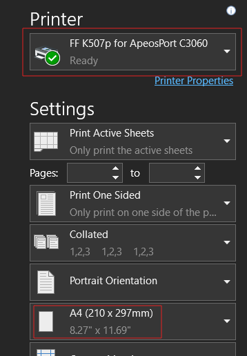
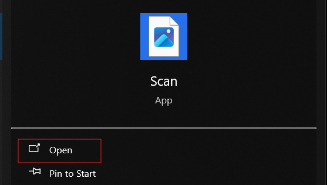
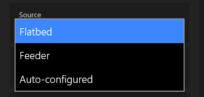
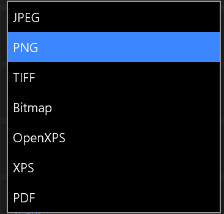

ရုံးကွန်ပြူတာတွေမှာ သက်ဆိုင်ရာပရင်တာ၊ စကင်နာအမျိုးအစားအလိုက် driver ထည့်ထားပြီးသားဖြစ်ပါတယ်။ လိုအပ်လျှင်မိမိရုံးက အိုင်တီအဖွဲ့ကိုဆက်သွယ်ပြီး driver ထည့်သွင်းနိုင်ပါတယ်။ အခုဥပမာမှာတော့ Fuji Xerox ကို network ချိတ်ဆက်ပြီး ပရင်တာ၊ စကင်နာအသုံးပြုကို ဖော်ပြထားပါတယ်

## Connect and Print

ပရင်တာချိတ်ဆက်ထားတဲ့ WiFi SSID ကို မိမိရုံးက အိုင်တီဌာနကတဆင့်မေးမြန်းပါ။ မိမိကွန်ပြူတာမှာဝင်ထားတဲ့ WiFi SSID နဲ့တူဖို့လိုပါတယ်။ ရုံးအများစုမှာ WiFi လိုင်းတစ်ခုမကရှိနိုင်တာကြောင့် ပရင်တာနဲ့ချိတ်ထားတဲ့ WiFi လိုင်းနဲ့ ကွန်ပြူတာက WiFi လိုင်းမတူရင် ပရင့်ထုတ်လို့မရဘဲရှိတတ်ပါတယ်

သက်ဆိုင်ရာ application ကနေ print နှိပ်ပြီး WiFi ချိတ်ထားတဲ့ပရင်တာကိုရွေးချယ်ပါ။ ယခုဥပမာမှာတော့ `ApeosPort C3060` နာမည်နဲ့ပရင်တာကိုရွေးချယ်ထားပါတယ်။

*Paper Size* မှာ **A4** ကိုရွေးပါ။ ပရင်တာအများစုမှာ ဘာစက္ကူပဲထည့်ထားထည့်ထား application မှာပေးလိုက်တဲ့ paper size အတိုင်းထုတ်ပေးပါတယ်။ ဥပမာ ပရင်တာထဲမှာ *A5* အရွယ်ထည့်ထားပေမယ့် application ကနေ *A4* နဲ့ထုတ်လိုက်ရင် တကယ့်အပြင်က *A5* စက္ကူမှာစာမျက်နှာတဝက်တပျက်ပဲ ပါလာတာမျိုးပါ။ Fuji Xerox လိုပရင်တာမျိုးမှာတော့ ပရင်တာမှာထည့်ထားတဲ့ စက္ကူကောအရွယ်အစားနဲ့ application ကထုတ်ခိုင်းလိုက်တဲ့ စက္ကူအရွယ်အစားတူမှ ထုတ်ပေးပါတယ်

## Connect and Scan
Windows မှာပါတဲ့ **Scan** application ကနေ WiFi ကတဆင့် scan ပြုလုပ်နိုင်ပါတယ်

Start Menu မှာ **Scan** လို့ရိုက်ထည့်ပြီး **Scan** application ကိုဖွင့်ပါ

*Scanner* မှာ WiFi ချိတ်ဆက်ထားတဲ့ scanner အမျိုးအစားကိုရွေးချယ်ပါ။ *Source* မှာ **Auto-configured** မရွေးဘဲ **Feeder** (သို့) **Flatbed** ကိုရွေးပါ။

:::note
စကင်ဖတ်မယ့်မူရင်းစာရွက်ကို စာရွက်ဆွဲတဲ့အံခွက်ထဲမှာထည့်ထားရင် *Feeder* ကိုရွေးပါ

မှန်ပြားပေါ်တင်ပြီး အဖုံးအုပ်ထားတာမျိုးဆိုရင် *Flatbed* ကိုရွေးပါ
:::

File Type မှာ PNG, JPEG and PDF စသည်ဖြင့် လိုချင်သည့်အပေါ်မူတည်၍ ရွေးချယ်ပါ။

စာရွက်တစ်ရွက်ထက်ပိုတဲ့အခါ Compiling PDF မှာ တခါတလေ error ပြတတ်ပါတယ်။ Error ပြရင် နောက်တစ်ကြိမ် scan ပြုလုပ်ပါ။

Scan completed ဖြစ်ပြီဆိုရင် `This PC/Pictures/Scans` ထဲကိုပုံတွေရောက်သွားမှာဖြစ်ပါတယ်