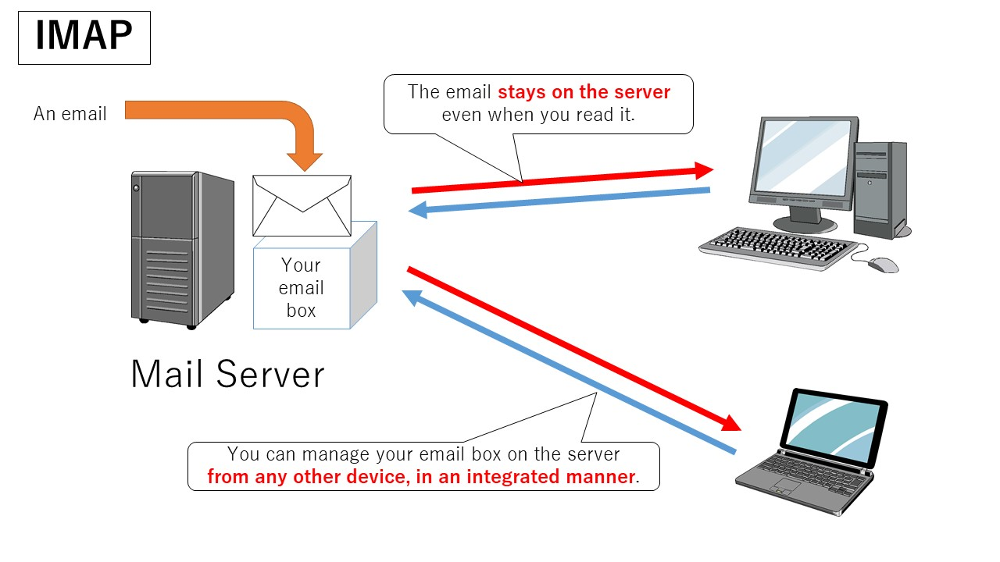
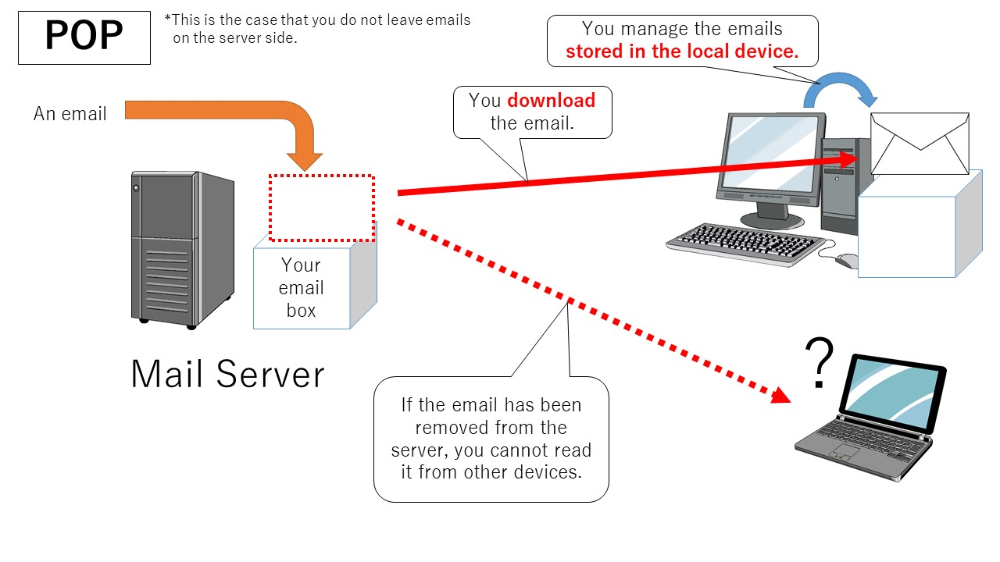

အီးမေးလ်တွေကို အပလီကေးရှင်းကနေချိတ်ဆက်တဲ့အခါမှာ **IMAP** နဲ့ **POP3** protocol နှစ်မျိုးနဲ့အသုံးပြုနိုင်ပါတယ်။
* **IMAP** မှာ အီးမေးလ်တွေရယ်၊ ကိုယ်ခွဲထားသမျှဖိုဒါတွေရယ်အားလုံးကို ဆာဗာမှာပဲသိမ်းထားတာဖြစ်ပါတယ်။ အပလီကေးရှင်းကနေတဆင့်ပြုလုပ်သမျှဟာ ဆာဗာပေါ်မှာပါလိုက်ပြောင်းပြီး ဆာဗာပေါ်မှာဖြစ်ပျက်သမျှဟာလည်း အပလီကေးရှင်းထဲမှာ လိုက်ပြောင်းနေမှာပါ
* **POP3** မှာ ဆာဗာပေါ်က အီးမေးလ်အားလုံးကို အပလီကေးရှင်းဖွင့်နေတဲ့ ကွန်ပြူတာ/မိုဘိုင်းထဲ ဒေါင်းလုဒ်လုပ်လိုက်ပါတယ်။ ပြီးရင်ဆာဗာပေါ်ကနေဖျက်ပစ်လိုက်ပါတယ်။ သုံးတဲ့အပလီကေးရှင်းပေါ်မူတည်ပြီး ဆာဗာပေါ်မှာကော်ပီတစ်ခုကျန်ခဲ့အောင် လုပ်လို့ရပါတယ်

## Choice of Protocol
* အီးမေးလ်ကို စက်တစ်လုံးထက်ပိုပြီးသုံးမယ်ဆိုရင် **IMAP** ချိတ်ပါ
* အီးမေးလ်ကို အပလီကေးရှင်းကကော၊ Webmail ကကောနှစ်မျိုးလုံးသုံးမယ်ဆိုရင် **IMAP** ချိတ်ပါ
* အီးမေးလ်ဆာဗာမှာ သိုမှီးနိုင်တဲ့ပမာဏဟာ 15GB အောက်ပဲရနိုင်ရင်တော့ **POP3** သုံးပါ
* အင်တာနက်ဆက်သွယ်မှုခက်တဲ့နေရာတွေ၊ မကြာခဏလိုင်းပြတ်တောက်တဲ့နေရာတွေမှာဆိုရင် **POP3** သုံးပါ

## IMAP
IMAP ရဲ့အရှည်က **I**nternet **M**ail **A**ccess **P**rotocol ပါ။ မေးလ်ဆာဗာပေါ်ကနေ ကော်ပီပဲယူပါတယ်။ သုံးနေတဲ့စက်ထဲမှာ ဖတ်ပြီး *(read)* ဖြစ်သွားတာ၊ folder ထဲထည့်လိုက်တာ စတဲ့အပြောင်းအလဲတွေဟာ ဆာဗာပေါ်မှာပါတခါတည်းလိုက်ပြောင်းပါတယ်

စက်ထဲဒေါင်းလုဒ်လုပ်ထားတဲ့ အီးမေးလ်တွေဟာ အင်တာနက်မရတော့ပေမယ့် ဆက်ကြည့်လို့ရနေဦးမှာပါ။ အင်တာနက်မရတဲ့အချိန်လုပ်ထားတဲ့ အပြောင်းအလဲတွေဟာ လိုင်းမိတာနဲ့ဆာဗာကိုချိတ်ဆက်လုပ်ဆောင်သွားမှာဖြစ်ပါတယ်။ IMAP ချိတ်ထားတဲ့စက်တစ်လုံးကနေ အပြောင်းအလဲလုပ်သမျှဟာ ဆာဗာပေါ်မှာကော၊ တခြား IMAP ချိတ်ဆက်ထားတဲ့စက်တွေမှာပါ တပြေးညီလိုက်ပြောင်းပေးပါတယ်။ စက်တစ်လုံးမှာ **SENT** လုပ်လိုက်တာ၊ **DRAFT** ထဲမှာသိမ်းထားတာတွေဟာလည်း တခြားစက်တွေမှာပါ လိုက်ပြောင်းလဲမှာဖြစ်ပါတယ်။

## POP3
POP3 ရဲ့အရှည်က **P**ost **O**ffice **P**rotocol (version**3**) ပါ။ ဆာဗာကနေ ဒေါင်းလုဒ်ပြီးတာနဲ့ဖျက်လိုက်ပါတယ်။ ဆာဗာပေါ်မှာလက်ခံမကျန်ခဲ့တော့ပါဘူး။ တခြားစက်တစ်လုံးကနေ POP3 နဲ့ထပ်ချိတ်သုံးမယ်ဆိုရင် အရင်ဒေါင်းလုဒ်လုပ်တဲ့စက်ထဲကိုအရင်ရောက်ပြီး နောက်စက်မှာဘာမှရောက်လာမှာမဟုတ်ပါဘူး။ စက်ထဲမှာအီးမေးလ်ကိုဖတ်လိုက်တာ၊ ဖိုဒါရွှေ့တာမှန်သမျှဟာ ဆာဗာပေါ်မှာလိုက်မပြောင်းပါဘူး။ တချို့အပလီကေးရှင်းတွေမှာ POP3 နဲ့ချိတ်ပေမယ့် ဆာဗာပေါ်မှာကော်ပီတစုံထားခဲ့ချင်ထားခဲ့လို့ရနိုင်တဲ့ setting ပါတတ်ပါတယ်၊ ဥပမာ (Thunderbird, Outlook, Gmail)။ POP3 သုံးပြီး ဆာဗာပေါ်ကော်ပီကျန်ခဲ့အောင်လုပ်ထားပေမယ့် **INBOX** ထဲရောက်တဲ့မေးလ်တွေသာ ကျန်ခဲ့တာဖြစ်ပြီး **SENT** လုပ်လိုက်တာတွေ၊ **DRAFT** ထဲသိမ်းထားတာတွေကတော့ POP3 နဲ့ချိတ်ထားတဲ့စက်ထဲမှာပဲ ကျန်ခဲ့ပါတယ်။ တခြားစက်တွေကနေဝင်ကြည့်မယ်ဆိုရင် **DRAFT** နဲ့ **SENT** တွေကိုတွေ့ရမှာမဟုတ်ပါဘူး။