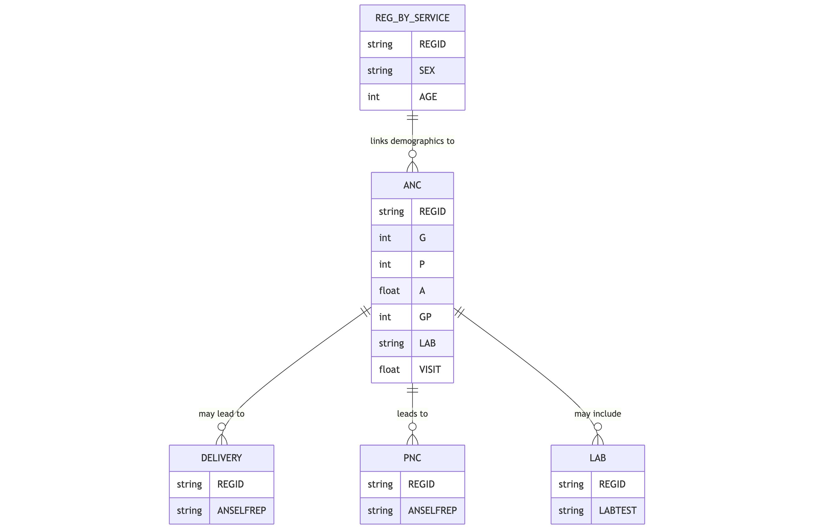

The `anc` table stores data related to antenatal care services provided to pregnant women, including vital measurements, laboratory tests, nutritional supplements, health education, and other informations of prenatal care.

## Schema Definition

| Field Name | Data Type | Description |
|------------|-----------|-------------|
| ORGNAME | String | Name of the healthcare organization providing the antenatal care service |
| REGID | String | Unique registration identifier linking to the reg_by_service table |
| CLINICNAME | String | Name of the specific clinic where the service was provided |
| TOWNSHIPNAME | String | Township name where the service was provided |
| VILLAGENAME | String | Village name where the service was provided |
| PROJECTNAME | String | Name of the project or program under which the service was provided |
| SEX | String | Gender of the patient, typically 'F' for antenatal care |
| AGE | Integer | Age of the pregnant woman |
| AGEUNIT | String | Unit of measurement for age, typically 'Years' |
| PROVIDEDDATE | String | Date when the antenatal care service was provided |
| PROVIDEDPLACE | String | Location type where the service was provided (e.g., facility, home visit) |
| PROVIDERPOSITION | String | Role or position of the healthcare provider (e.g., midwife, doctor) |
| G | Integer | Gravida - number of pregnancies including current pregnancy |
| P | Float | Parity - number of births past the age of viability |
| A | Float | Abortion - number of pregnancy losses before the age of viability |
| WT | Float | Weight of the pregnant woman in kilograms |
| HT | Float | Height of the pregnant woman in centimeters |
| BP | String | Blood pressure measurement in mmHg format (e.g., "120/80") |
| TEMP | Float | Body temperature |
| TEMPUNIT | String | Unit of measurement for temperature (e.g., 'C' for Celsius) |
| GP | Integer | Gestational period in weeks |
| LAB | String | Laboratory tests performed and their results |
| FA | Float | Folic acid supplements provided (quantity) |
| FESO4 | Float | Iron supplements provided (quantity) |
| FC | String | Calcium supplements provided |
| B1 | Float | Vitamin B1 supplements provided (quantity) |
| FAFESO4 | Float | Combined folic acid and iron supplements provided (quantity) |
| DEWORMING1STDOSE | String | First dose of deworming medication provided |
| DEWORMING2NDDOSE | String | Second dose of deworming medication provided |
| TETANUS1STDOSE | String | First dose of tetanus toxoid immunization |
| TETANUS2NDDOSE | String | Second dose of tetanus toxoid immunization |
| CDK | String | Clean delivery kit provided |
| NBK | String | Newborn kit provided |
| MATERNALNUTRITIONHE | String | Maternal nutrition health education provided |
| FAMILYPLANNINGHE | String | Family planning health education provided |
| NEWBORNCAREHE | String | Newborn care health education provided |
| DELIVERYPLANHE | String | Delivery plan health education provided |
| EMERGENCYRESPONSEPLANHE | String | Emergency response plan health education provided |
| DANGERSIGNSHE | String | Danger signs health education provided |
| EXCLUSIVEBREASTFEEDINGHE | String | Exclusive breastfeeding health education provided |
| RTISHIVSTIHE | String | RTI/HIV/STI health education provided |
| IMMUNIZATIONHE | String | Immunization health education provided |
| RESTWORKHE | String | Rest and work balance health education provided |
| HYGIENEHE | String | Hygiene health education provided |
| DRUGALCOHOLUSEHE | String | Drug and alcohol use health education provided |
| SMOKINGHE | String | Smoking health education provided |
| OUTCOME | String | Outcome of the antenatal visit |
| REFTO | String | Facility referred to, if applicable |
| REFREASON | String | Reason for referral |
| REFERRALTOOTHER | String | Other referral details |
| DEATHREASON | String | Reason for death, if applicable |
| VISIT | Float | Visit number in the antenatal care sequence |
| VTCOUNT | Float | Total number of antenatal visits to date |
| VISITSKILL | Float | Indicator of whether visit was with skilled provider |
| VISITTIMING | Float | Timing of visit (trimester) |
| VISITTIMINGSKILL | Float | Indicator of visit timing and skilled provider combined |
| MIGRANTWORKER | String | Flag indicating migrant worker status |
| IDP | String | Flag indicating internally displaced person status |
| DISABILITY | String | Flag indicating disability status |
| OTHERDIAGNOSIS | String | Other diagnoses identified during the visit |
| TREATMENTCOMLICATIONS | String | Treatments for complications, if any |

## Field Details

### Basic Information

**ORGNAME, CLINICNAME, TOWNSHIPNAME, VILLAGENAME, PROJECTNAME**
These fields store the service delivery context, including the organizational, geographic, and programmatic setting.

**REGID**
This unique identifier links to the `reg_by_service` table, connecting antenatal care data with the patient's demographic information and other services received.

**PROVIDEDDATE, PROVIDEDPLACE, PROVIDERPOSITION**
These fields document when and where the service was provided and by what type of healthcare worker.

### Obstetric History

**G, P, A**
These standard obstetric notation fields track the woman's pregnancy history.
- G (Gravida): Total number of pregnancies, including the current one
- P (Parity): Number of births of viable offspring
- A (Abortion): Number of pregnancy losses before viability

### Vital Signs and Measurements

**WT, HT, BP, TEMP, TEMPUNIT**
These fields record the woman's physical measurements and vital signs during the visit.

**GP**
The gestational period in weeks is critical for assessing fetal development against expected milestones and planning appropriate care.

### Laboratory Tests

**LAB**
This field records laboratory tests performed during the antenatal visit and their results. Tests may include hemoglobin level, blood type, HIV status, syphilis screening, urinalysis, and other diagnostics relevant to maternal and fetal health.

### Supplementation and Preventive Measures

**FA, FESO4, FC, B1, FAFESO4**
These fields document nutritional supplements provided to prevent common deficiencies during pregnancy.
- Folic acid to prevent neural tube defects
- Iron to prevent anemia
- Calcium to support bone development and prevent pre-eclampsia
- Vitamin B1 to support neurological development

**DEWORMING1STDOSE, DEWORMING2NDDOSE**
These fields track deworming medication provided to prevent parasitic infections that can contribute to anemia and malnutrition.

**TETANUS1STDOSE, TETANUS2NDDOSE**
These fields document tetanus toxoid immunization, which is crucial for preventing neonatal tetanus.

**CDK, NBK**
These fields indicate whether clean delivery kits and newborn kits were provided to support safe delivery practices, especially for home births.

### Health Education

Multiple fields track health education topics covered during the antenatal visit:

**MATERNALNUTRITIONHE through SMOKINGHE**
These fields document the specific health education topics covered during the visit.
### Visit Outcomes and Referrals

**OUTCOME, REFTO, REFREASON, REFERRALTOOTHER, DEATHREASON**
These fields capture the outcome of the visit, including any referrals made to other facilities or specialists and the reasons for such referrals. In rare cases, if the outcome was maternal death, the cause is recorded.

### Visit Tracking

**VISIT, VTCOUNT, VISITSKILL, VISITTIMING, VISITTIMINGSKILL**
These fields monitor the sequence, timing, and quality of antenatal care.
- Visit number in the sequence
- Total number of antenatal visits to date
- Whether the visit was with a skilled provider
- Timing of the visit by trimester
- Combined indicator of timing and provider skill

### Vulnerability Indicators

**MIGRANTWORKER, IDP, DISABILITY**
These fields identify pregnant women belonging to vulnerable populations, enabling targeted support and equity analysis.

### Additional Clinical Information

**OTHERDIAGNOSIS, TREATMENTCOMLICATIONS**
These fields capture other health conditions identified during the visit and treatments provided for pregnancy complications, supporting comprehensive clinical care and complication management.

## Relationships with Other Tables

The primary relationship is through the REGID field, which links to the `reg_by_service` table. Additionally, laboratory tests recorded in the LAB field may have detailed results in the `lab` table. The antenatal care record also provides context for subsequent `delivery` and `pnc` (postnatal care) records.
