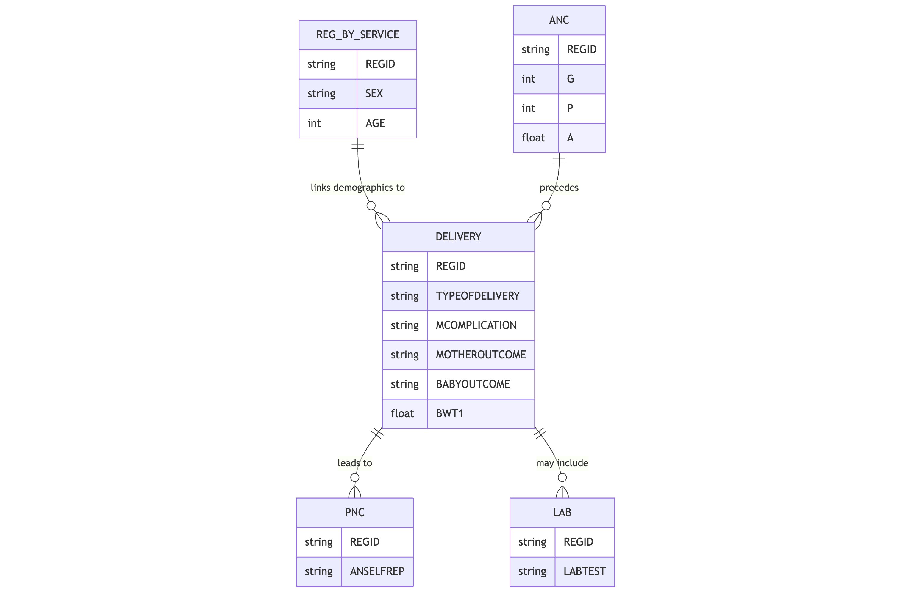

The `delivery` table records information about childbirth events within the Health Management Information System. This table stores data about both maternal and newborn outcomes during the delivery process.

## Schema Definition

| Field Name | Data Type | Description |
|------------|-----------|-------------|
| ORGNAME | String | Name of the healthcare organization providing the delivery service |
| REGID | String | Unique registration identifier linking to the reg_by_service table |
| CLINICNAME | String | Name of the specific clinic where the delivery occurred |
| TOWNSHIPNAME | String | Township name where the delivery service was provided |
| VILLAGENAME | String | Village name where the delivery service was provided |
| PROJECTNAME | String | Name of the project or program under which the service was provided |
| SEX | String | Gender of the patient, typically 'F' for delivery services |
| AGE | Integer | Age of the woman giving birth |
| AGEUNIT | String | Unit of measurement for age, typically 'Years' |
| PROVIDEDDATE | String | Date when the delivery occurred |
| PROVIDEDPLACE | String | Location type where the delivery occurred (e.g., facility, home) |
| PROVIDERPOSITION | String | Role or position of the healthcare provider attending the delivery |
| MCOMPLICATION | String | Maternal complications experienced during delivery |
| MPROCEDURE | String | Procedures performed to address maternal complications |
| MATERNALTREATMENT | String | Treatments administered to the mother during delivery |
| TYPEOFDELIVERY | String | Method of delivery (e.g., vaginal, cesarean section, instrumental) |
| G | Integer | Gravida - number of pregnancies including current pregnancy |
| P | Float | Parity - number of births past the age of viability |
| A | Float | Abortion - number of pregnancy losses before the age of viability |
| LAB | String | Laboratory tests performed during delivery and their results |
| MOTHEROUTCOME | String | Outcome for the mother after delivery |
| MREFTO | String | Facility the mother was referred to, if applicable |
| MREFREASON | String | Reason for maternal referral |
| MDEATHREASON | String | Reason for maternal death, if applicable |
| ANSELFREP | Float | Self-reported number of antenatal care visits received |
| BABYOUTCOME | String | Overall outcome for the baby/babies |
| BDELIOUTCOME | String | Specific delivery outcome for the baby/babies |
| BREFTO | String | Facility the baby was referred to, if applicable |
| BREFREASON | String | Reason for neonatal referral |
| BDEATHREASON | String | Reason for neonatal death, if applicable |
| BSEX1 | String | Sex of first baby in case of multiple births |
| BSEX2 | String | Sex of second baby in case of multiple births |
| BSEX3 | String | Sex of third baby in case of multiple births |
| BWT1 | Float | Birth weight of first baby in kilograms |
| BWT2 | String | Birth weight of second baby in kilograms |
| BWT3 | String | Birth weight of third baby in kilograms |
| BBF1 | String | Breastfeeding initiation for first baby |
| BBF2 | String | Breastfeeding initiation for second baby |
| BBF3 | String | Breastfeeding initiation for third baby |
| ERRORCOMMENTREMARK | String | Notes on any errors or special circumstances |
| MIGRANTWORKER | String | Flag indicating migrant worker status |
| DISABILITY | String | Flag indicating disability status |
| TOWEL | String | Use of clean, dry towel for newborn care |
| MASK | String | Use of resuscitation mask, if needed |
| SUCTION | String | Performance of suction for clearing airways |
| COMPRESSION | String | Chest compressions performed, if needed |
| STIMULATION | String | Stimulation performed for newborn respiration |

## Field Details

### Organizational and Demographic Information

**ORGNAME, CLINICNAME, TOWNSHIPNAME, VILLAGENAME, PROJECTNAME**
These fields establish the organizational and geographic context of the delivery event.

**REGID**
This unique identifier links to the `reg_by_service` table, connecting delivery data with the mother's demographic information and other services received, particularly antenatal care.

**SEX, AGE, AGEUNIT**
These demographic fields record the sex, age, and age unit of the mother.

**PROVIDEDDATE, PROVIDEDPLACE, PROVIDERPOSITION**
These fields document when and where the delivery occurred and the qualification level of the attendant.

### Maternal Clinical Information

**MCOMPLICATION, MPROCEDURE, MATERNALTREATMENT**
Any complications the mother experienced during delivery, the procedures performed to address those complications, and the treatments administered.

**TYPEOFDELIVERY**
This field records the method of delivery, which may include spontaneous vaginal delivery, assisted vaginal delivery (forceps or vacuum), or cesarean section.

**G, P, A**
These standard obstetric notation fields document the woman's pregnancy history.
- G (Gravida): Total number of pregnancies, including the current one
- P (Parity): Number of births of viable offspring
- A (Abortion): Number of pregnancy losses before viability

**LAB**
This field records laboratory tests conducted during labor and delivery and their results, which may include rapid hemoglobin assessment, blood typing, or other emergency diagnostics.

**MOTHEROUTCOME**
This field captures the maternal outcome following delivery, which may include normal recovery, complications requiring extended care, or, in severe cases, maternal death.

**MREFTO, MREFREASON**
These fields document referrals to higher-level facilities for maternal complications, including the destination facility and the clinical reason for referral.

**MDEATHREASON**
In the unfortunate event of maternal death, this field documents the clinical cause, supporting maternal mortality analysis and prevention efforts.

**ANSELFREP**
This field records the number of antenatal care visits the woman reports having received during her pregnancy.

### Newborn Information

**BABYOUTCOME, BDELIOUTCOME**
These fields capture the overall outcome for the newborn and the specific delivery outcome.

**BREFTO, BREFREASON**
These fields document referrals for newborn complications, including the destination facility and clinical reason for referral.

**BDEATHREASON**
In cases of neonatal death, this field records the clinical cause.

**BSEX1, BSEX2, BSEX3**
These fields record the sex of each baby in case of multiple births.

**BWT1, BWT2, BWT3**
These fields document the birth weight of each baby in kilograms.

**BBF1, BBF2, BBF3**
These fields record early breastfeeding initiation for each baby.

### Newborn Resuscitation and Care

**TOWEL, MASK, SUCTION, COMPRESSION, STIMULATION**
These fields document specific newborn resuscitation and immediate care interventions.
- Use of clean, dry towel for drying and warming
- Application of resuscitation mask for assisted breathing
- Suctioning to clear airways
- Chest compressions for severe cases
- Stimulation to encourage breathing

### Additional Information

**ERRORCOMMENTREMARK**
This field allows for documentation of any errors, special circumstances, or additional information relevant to the delivery record.

**MIGRANTWORKER, DISABILITY**
These fields identify mothers belonging to specific vulnerable populations.

## Relationships with Other Tables

The primary relationship is through the REGID field, which links to the `reg_by_service` table for demographic information. The delivery record typically follows antenatal care records and precedes postnatal care records for the same woman. Laboratory tests recorded in the LAB field may have detailed results in the `lab` table.
