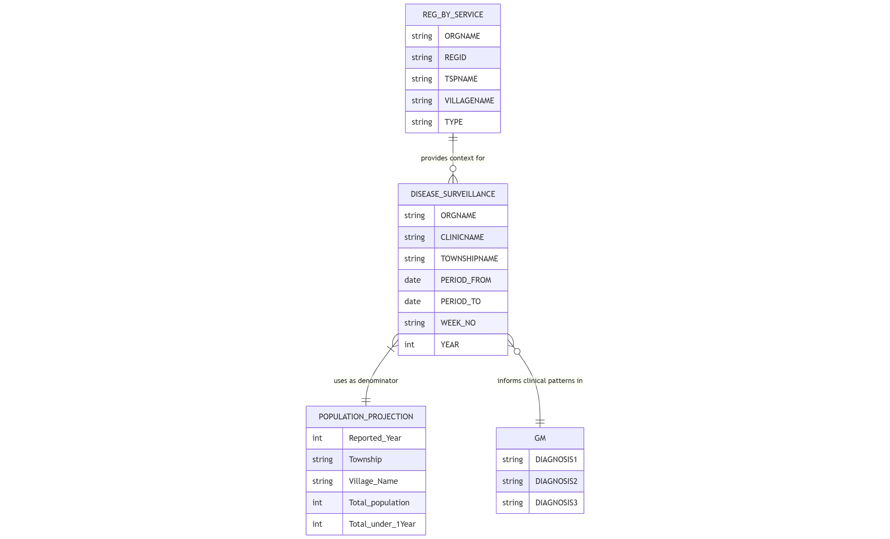

The `disease_surveillance` table records reportable diseases monitored through the Health Management Information System. This table captures weekly surveillance data on various communicable diseases, their case counts, mortality, and other relevant details.

## Schema Definition

| Field Name | Data Type | Description |
|------------|-----------|-------------|
| ORGNAME | String | Name of the healthcare organization reporting the surveillance data |
| CLINICNAME | String | Name of the specific clinic or Village Tract Health Center providing the report |
| TOWNSHIPNAME | String | Township name where the surveillance data was collected |
| PERIOD_FROM | Date | Start date of the surveillance reporting period |
| PERIOD_TO | Date | End date of the surveillance reporting period |
| WEEK_NO | String | Week number in the epidemiological calendar |
| YEAR | Integer | Year of the surveillance report |
| TECHNICIAN_PHONE | String | Contact phone number of the technical assistant responsible for reporting |
| TECHNICIAN_EMAIL | String | Email address of the technical assistant responsible for reporting |
| SO_ID | String | Unique identifier for the supervising officer or organization unit |
| AFP_CASES_UNDER5 | Integer | Number of Acute Flaccid Paralysis cases in children under 5 years |
| AFP_CASES_5ABOVE | Integer | Number of Acute Flaccid Paralysis cases in persons 5 years and above |
| AFP_DEATHS_UNDER5 | Integer | Number of deaths from Acute Flaccid Paralysis in children under 5 years |
| AFP_DEATHS_5ABOVE | Integer | Number of deaths from Acute Flaccid Paralysis in persons 5 years and above |
| AFP_REMARKS | String | Additional notes or observations regarding Acute Flaccid Paralysis cases |
| MEASLES_CASES_UNDER5 | Integer | Number of suspected measles cases in children under 5 years |
| MEASLES_CASES_5ABOVE | Integer | Number of suspected measles cases in persons 5 years and above |
| MEASLES_DEATHS_UNDER5 | Integer | Number of deaths from suspected measles in children under 5 years |
| MEASLES_DEATHS_5ABOVE | Integer | Number of deaths from suspected measles in persons 5 years and above |
| MEASLES_REMARKS | String | Additional notes or observations regarding suspected measles cases |
| NNT_CASES_UNDER5 | Integer | Number of Neonatal Tetanus cases in children under 5 years |
| NNT_CASES_5ABOVE | Integer | Number of Neonatal Tetanus cases in persons 5 years and above |
| NNT_DEATHS_UNDER5 | Integer | Number of deaths from Neonatal Tetanus in children under 5 years |
| NNT_DEATHS_5ABOVE | Integer | Number of deaths from Neonatal Tetanus in persons 5 years and above |
| NNT_REMARKS | String | Additional notes or observations regarding Neonatal Tetanus cases |
| DIPHTHERIA_CASES_UNDER5 | Integer | Number of probable Diphtheria cases in children under 5 years |
| DIPHTHERIA_CASES_5ABOVE | Integer | Number of probable Diphtheria cases in persons 5 years and above |
| DIPHTHERIA_DEATHS_UNDER5 | Integer | Number of deaths from probable Diphtheria in children under 5 years |
| DIPHTHERIA_DEATHS_5ABOVE | Integer | Number of deaths from probable Diphtheria in persons 5 years and above |
| DIPHTHERIA_REMARKS | String | Additional notes or observations regarding probable Diphtheria cases |
| PERTUSSIS_CASES_UNDER5 | Integer | Number of Pertussis cases in children under 5 years |
| PERTUSSIS_CASES_5ABOVE | Integer | Number of Pertussis cases in persons 5 years and above |
| PERTUSSIS_DEATHS_UNDER5 | Integer | Number of deaths from Pertussis in children under 5 years |
| PERTUSSIS_DEATHS_5ABOVE | Integer | Number of deaths from Pertussis in persons 5 years and above |
| PERTUSSIS_REMARKS | String | Additional notes or observations regarding Pertussis cases |
| ILI_ARI_CASES_UNDER5 | Integer | Number of Influenza-like illness/Acute Respiratory Infection cases in children under 5 years |
| ILI_ARI_CASES_5ABOVE | Integer | Number of Influenza-like illness/Acute Respiratory Infection cases in persons 5 years and above |
| ILI_ARI_DEATHS_UNDER5 | Integer | Number of deaths from Influenza-like illness/Acute Respiratory Infection in children under 5 years |
| ILI_ARI_DEATHS_5ABOVE | Integer | Number of deaths from Influenza-like illness/Acute Respiratory Infection in persons 5 years and above |
| ILI_ARI_REMARKS | String | Additional notes or observations regarding Influenza-like illness/Acute Respiratory Infection cases |
| SARI_CASES_UNDER5 | Integer | Number of Severe Acute Respiratory Infection cases in children under 5 years |
| SARI_CASES_5ABOVE | Integer | Number of Severe Acute Respiratory Infection cases in persons 5 years and above |
| SARI_DEATHS_UNDER5 | Integer | Number of deaths from Severe Acute Respiratory Infection in children under 5 years |
| SARI_DEATHS_5ABOVE | Integer | Number of deaths from Severe Acute Respiratory Infection in persons 5 years and above |
| SARI_REMARKS | String | Additional notes or observations regarding Severe Acute Respiratory Infection cases |
| AWD_SEVERE_CASES_UNDER5 | Integer | Number of Acute Watery Diarrhea with severe dehydration cases in children under 5 years |
| AWD_SEVERE_CASES_5ABOVE | Integer | Number of Acute Watery Diarrhea with severe dehydration cases in persons 5 years and above |
| AWD_SEVERE_DEATHS_UNDER5 | Integer | Number of deaths from Acute Watery Diarrhea with severe dehydration in children under 5 years |
| AWD_SEVERE_DEATHS_5ABOVE | Integer | Number of deaths from Acute Watery Diarrhea with severe dehydration in persons 5 years and above |
| AWD_SEVERE_REMARKS | String | Additional notes or observations regarding Acute Watery Diarrhea with severe dehydration cases |
| AWD_MODERATE_CASES_UNDER5 | Integer | Number of Acute Watery Diarrhea with moderate dehydration cases in children under 5 years |
| AWD_MODERATE_CASES_5ABOVE | Integer | Number of Acute Watery Diarrhea with moderate dehydration cases in persons 5 years and above |
| AWD_MODERATE_DEATHS_UNDER5 | Integer | Number of deaths from Acute Watery Diarrhea with moderate dehydration in children under 5 years |
| AWD_MODERATE_DEATHS_5ABOVE | Integer | Number of deaths from Acute Watery Diarrhea with moderate dehydration in persons 5 years and above |
| AWD_MODERATE_REMARKS | String | Additional notes or observations regarding Acute Watery Diarrhea with moderate dehydration cases |
| AWD_MILD_CASES_UNDER5 | Integer | Number of Acute Watery Diarrhea with no dehydration cases in children under 5 years |
| AWD_MILD_CASES_5ABOVE | Integer | Number of Acute Watery Diarrhea with no dehydration cases in persons 5 years and above |
| AWD_MILD_DEATHS_UNDER5 | Integer | Number of deaths from Acute Watery Diarrhea with no dehydration in children under 5 years |
| AWD_MILD_DEATHS_5ABOVE | Integer | Number of deaths from Acute Watery Diarrhea with no dehydration in persons 5 years and above |
| AWD_MILD_REMARKS | String | Additional notes or observations regarding Acute Watery Diarrhea with no dehydration cases |
| AJS_CASES_UNDER5 | Integer | Number of Acute Jaundice Syndrome cases in children under 5 years |
| AJS_CASES_5ABOVE | Integer | Number of Acute Jaundice Syndrome cases in persons 5 years and above |
| AJS_DEATHS_UNDER5 | Integer | Number of deaths from Acute Jaundice Syndrome in children under 5 years |
| AJS_DEATHS_5ABOVE | Integer | Number of deaths from Acute Jaundice Syndrome in persons 5 years and above |
| AJS_REMARKS | String | Additional notes or observations regarding Acute Jaundice Syndrome cases |
| AES_CASES_UNDER5 | Integer | Number of Acute Encephalitis Syndrome cases in children under 5 years |
| AES_CASES_5ABOVE | Integer | Number of Acute Encephalitis Syndrome cases in persons 5 years and above |
| AES_DEATHS_UNDER5 | Integer | Number of deaths from Acute Encephalitis Syndrome in children under 5 years |
| AES_DEATHS_5ABOVE | Integer | Number of deaths from Acute Encephalitis Syndrome in persons 5 years and above |
| AES_REMARKS | String | Additional notes or observations regarding Acute Encephalitis Syndrome cases |
| MALARIA_CONF_CASES_UNDER5 | Integer | Number of confirmed Malaria cases in children under 5 years |
| MALARIA_CONF_CASES_5ABOVE | Integer | Number of confirmed Malaria cases in persons 5 years and above |
| MALARIA_CONF_DEATHS_UNDER5 | Integer | Number of deaths from confirmed Malaria in children under 5 years |
| MALARIA_CONF_DEATHS_5ABOVE | Integer | Number of deaths from confirmed Malaria in persons 5 years and above |
| MALARIA_CONF_REMARKS | String | Additional notes or observations regarding confirmed Malaria cases |
| MALARIA_CLIN_CASES_UNDER5 | Integer | Number of clinically suspected Malaria cases in children under 5 years |
| MALARIA_CLIN_CASES_5ABOVE | Integer | Number of clinically suspected Malaria cases in persons 5 years and above |
| MALARIA_CLIN_DEATHS_UNDER5 | Integer | Number of deaths from clinically suspected Malaria in children under 5 years |
| MALARIA_CLIN_DEATHS_5ABOVE | Integer | Number of deaths from clinically suspected Malaria in persons 5 years and above |
| MALARIA_CLIN_REMARKS | String | Additional notes or observations regarding clinically suspected Malaria cases |
| DENGUE_CASES_UNDER5 | Integer | Number of Dengue Fever cases in children under 5 years |
| DENGUE_CASES_5ABOVE | Integer | Number of Dengue Fever cases in persons 5 years and above |
| DENGUE_DEATHS_UNDER5 | Integer | Number of deaths from Dengue Fever in children under 5 years |
| DENGUE_DEATHS_5ABOVE | Integer | Number of deaths from Dengue Fever in persons 5 years and above |
| DENGUE_REMARKS | String | Additional notes or observations regarding Dengue Fever cases |
| REPORT_STATUS | String | Current status of the surveillance report |
| REPORTER_NAME | String | Name of the person who completed the report |
| DATE_SENT | Date | Date when the report was submitted |
| COMPLETENESS | String | Assessment of report completeness |
| TIMELINESS | String | Assessment of report timeliness |

## Relationships with Other Tables

The relationship with the `reg_by_service` table establishes organizational and geographic continuity. The `population_projection` table provides denominator data for calculating disease incidence rates. Findings from disease surveillance can inform clinical patterns observed in the `gm` (General Medical) consultations table.