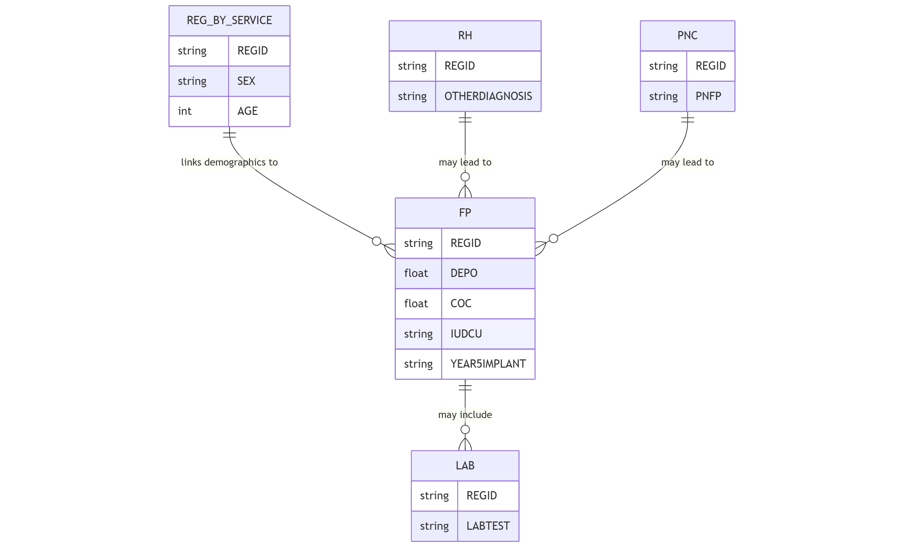

The `fp` table records family planning services provided within the Health Management Information System.

## Schema Definition

| Field Name | Data Type | Description |
|------------|-----------|-------------|
| ORGNAME | String | Name of the healthcare organization providing the service |
| REGID | String | Unique registration identifier linking to the reg_by_service table |
| CLINICNAME | String | Name of the specific clinic where the service was provided |
| TOWNSHIPNAME | String | Township name where the service was provided |
| VILLAGENAME | String | Village name where the service was provided |
| PROJECTNAME | String | Name of the project or program under which the service was provided |
| SEX | String | Gender of the client |
| AGE | Integer | Age of the client |
| AGEUNIT | String | Unit of measurement for age (e.g., Years, Months, Days) |
| PROVIDEDDATE | String | Date when the family planning service was provided |
| PROVIDEDPLACE | String | Location type where the service was provided |
| PROVIDERPOSITION | String | Role or position of the healthcare provider |
| WT | Float | Weight of the client in kilograms |
| HT | Float | Height of the client in centimeters |
| BP | String | Blood pressure measurement in mmHg format (e.g., "120/80") |
| PR | Float | Pulse rate in beats per minute |
| RR | Float | Respiratory rate in breaths per minute |
| TEMP | Float | Body temperature |
| TEMPUNIT | String | Unit of measurement for temperature (e.g., 'C' for Celsius) |
| P | Float | Parity - number of births past the age of viability |
| A | Float | Abortion - number of pregnancy losses before the age of viability |
| MALECONDOM | Float | Number of male condoms distributed |
| FEMALECONDOM | String | Number of female condoms distributed |
| DEPO | Float | Depo-Provera injectable contraceptive provided |
| COC | Float | Combined Oral Contraceptive pills provided |
| POP | Float | Progestin-Only Pills provided |
| EC | Float | Emergency Contraception provided |
| YEAR3IMPLANT | String | 3-year contraceptive implant provided |
| YEAR4IMPLANT | String | 4-year contraceptive implant provided |
| YEAR5IMPLANT | String | 5-year contraceptive implant provided |
| NEWACCEPTOR | String | Flag indicating new family planning acceptor |
| IUDCU | String | Copper intrauterine device provided |
| IUDMULTI | String | Multiload intrauterine device provided |
| REFIMP | String | Referral for implant |
| REFIUD | String | Referral for intrauterine device |
| REFTL | String | Referral for tubal ligation |
| REFVT | String | Referral for vasectomy |
| CSLFP | String | Counseling for family planning |
| CSLFER | String | Counseling for fertility |
| MALECONDOMBK | Float | Male condoms provided as backup method |
| FEMALECONDOMBK | Float | Female condoms provided as backup method |
| ECBK | String | Emergency contraception provided as backup method |
| LAB | String | Laboratory tests performed and their results |
| OUTCOME | String | Outcome of the family planning visit |
| REFTO | String | Facility referred to, if applicable |
| REFREASON | String | Reason for referral |
| REFERRALTOOTHER | String | Other referral details |
| DEATHREASON | String | Reason for death, if applicable |
| DEPOSC | Float | Social marketing Depo-Provera provided |
| ERRORCOMMENTREMARK | String | Notes on any errors or special circumstances |
| REMOVAL | String | Removal of long-acting contraceptive method |
| PREGNANTWOMEN | String | Flag indicating pregnancy status |
| LACTATINGMOTHER | String | Flag indicating lactating mother status |
| MIGRANTWORKER | String | Flag indicating migrant worker status |
| DISABILITY | String | Flag indicating disability status |

## Field Details

### Organizational and Demographic Information

**ORGNAME, CLINICNAME, TOWNSHIPNAME, VILLAGENAME, PROJECTNAME**
These fields establish the organizational and geographic context of the family planning visit.

**REGID**
This unique identifier links to the `reg_by_service` table, connecting family planning data with the client's demographic information and other healthcare services received.

**SEX, AGE, AGEUNIT**
These demographic fields record the client's sex, age, and age unit. While most family planning clients are female, the system also captures services for male clients, such as condom provision or vasectomy referrals.

**PROVIDEDDATE, PROVIDEDPLACE, PROVIDERPOSITION**
These fields document when and where the service was provided and by what type of healthcare worker.

### Physical Assessment

**WT, HT, BP, PR, RR, TEMP, TEMPUNIT**
These fields record the client's physical measurements and vital signs during the family planning visit.

### Reproductive History

**P, A**
These obstetric notation fields document the woman's pregnancy history.
- P (Parity): Number of births past the age of viability
- A (Abortion): Number of pregnancy losses before viability

**PREGNANTWOMEN, LACTATINGMOTHER**
These fields indicate pregnancy and lactation status, which significantly impact contraceptive eligibility and choice. Pregnant women require postpartum family planning counseling, while lactating mothers need methods compatible with breastfeeding.

### Contraceptive Methods Provided

**Short-Acting Methods**
- **MALECONDOM, FEMALECONDOM** Condoms distributed
- **DEPO, DEPOSC** Injectable contraceptives provided
- **COC, POP** Oral contraceptive pills provided, including both combined and progestin-only formulations
- **EC** Emergency contraception provided for post-coital pregnancy prevention

**Long-Acting Reversible Contraception (LARC)**
- **YEAR3IMPLANT, YEAR4IMPLANT, YEAR5IMPLANT** Contraceptive implants provided, categorized by duration of effectiveness
- **IUDCU, IUDMULTI**: Intrauterine devices provided, including copper and multiload

**Backup Methods**
- **MALECONDOMBK, FEMALECONDOMBK, ECBK** Backup contraceptive methods provided to supplement primary methods

**Service Status Indicators**
- **NEWACCEPTOR** Indicates whether the client is new to family planning or returning
- **REMOVAL** Documents removal of previously inserted long-acting methods such as implants or IUDs

### Referrals for Methods Not Provided Onsite

**REFIMP, REFIUD, REFTL, REFVT**
These fields document referrals for contraceptive methods that may not be available at the current facility.
- Implant insertion
- IUD insertion
- Tubal ligation (female sterilization)
- Vasectomy (male sterilization)

### Counseling Services

**CSLFP, CSLFER**
These fields record counseling services provided during the visit
- Family planning counseling, including method options, correct use, side effects, and benefits
- Fertility counseling for clients seeking to conceive

### Clinical Assessment and Outcomes

**LAB**
This field documents laboratory tests performed as part of family planning care, which may include pregnancy testing, STI screening, or other assessments relevant to contraceptive eligibility.

**OUTCOME**
This field captures the result of the family planning visit, such as successful method provision, counseling only, or referral to another service.

**REFTO, REFREASON, REFERRALTOOTHER**
These fields document referrals to other healthcare services or specialists beyond the method-specific referrals, including the destination and clinical rationale.

**DEATHREASON**
In the extremely rare event of death related to contraceptive provision (e.g., severe allergic reaction), this field records the cause.

### Vulnerability Indicators

**MIGRANTWORKER, DISABILITY**
These fields identify clients belonging to specific vulnerable populations.

### Additional Information

**ERRORCOMMENTREMARK**
This field allows for documentation of any errors, special circumstances, or additional information relevant to the family planning visit.

## Relationships with Other Tables

The primary relationship is through the REGID field, which links to the `reg_by_service` table for client demographics. Laboratory tests recorded in the LAB field may have detailed results in the `lab` table. Additionally, family planning services often follow reproductive health services or postnatal care, creating relationships with the `rh` and `pnc` tables.