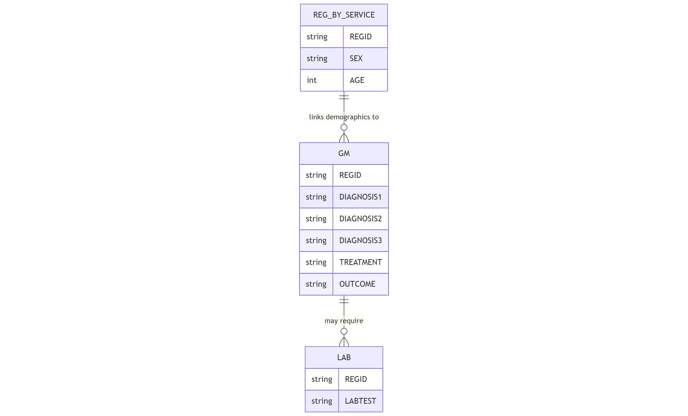

The `gm` table records general medical consultations provided within the Health Management Information System. This table captures a wide range of clinical data, from patient vital signs to diagnoses, treatments, and outcomes across all general healthcare services.

## Schema Definition

| Field Name | Data Type | Description |
|------------|-----------|-------------|
| ORGNAME | String | Name of the healthcare organization providing the service |
| REGID | String | Unique registration identifier linking to the reg_by_service table |
| CLINICNAME | String | Name of the specific clinic where the service was provided |
| TOWNSHIPNAME | String | Township name where the service was provided |
| VILLAGENAME | String | Village name where the service was provided |
| PROJECTNAME | String | Name of the project or program under which the service was provided |
| SEX | String | Gender of the patient |
| AGE | Integer | Age of the patient |
| AGEUNIT | String | Unit of measurement for age (e.g., Years, Months, Days) |
| PROVIDEDDATE | String | Date when the service was provided |
| PROVIDEDPLACE | String | Location type where the service was provided |
| PROVIDERPOSITION | String | Role or position of the healthcare provider |
| WT | Float | Weight of the patient in kilograms |
| HT | Float | Height of the patient in centimeters |
| BP | String | Blood pressure measurement in mmHg format (e.g., "120/80") |
| PR | Float | Pulse rate in beats per minute |
| RR | Float | Respiratory rate in breaths per minute |
| TEMP | Float | Body temperature |
| TEMPUNIT | String | Unit of measurement for temperature (e.g., 'C' for Celsius) |
| P | Float | Parity - number of births past the age of viability (for women) |
| A | Float | Abortion - number of pregnancy losses before the age of viability (for women) |
| HE | String | Health education provided during the visit |
| GMTYPE | String | Type of general medical service provided |
| PREG | String | Pregnancy status, if applicable |
| LAB | String | Laboratory tests performed and their results |
| OTHERDIAGNOSIS | String | Additional diagnoses not covered by primary diagnostic fields |
| DIAGNOSIS1 | String | Primary diagnosis |
| DIAGNOSIS2 | String | Secondary diagnosis, if applicable |
| DIAGNOSIS3 | String | Tertiary diagnosis, if applicable |
| COMPLAINT | String | Chief complaint or presenting symptoms |
| PROCEDURE | String | Procedures performed during the consultation |
| TREATMENT | String | Treatments or medications provided |
| OUTCOME | String | Outcome of the clinical visit |
| REFERRAL | String | Referral made to other healthcare services |
| REFERRALTOOTHER | String | Other referral details |
| REFERRALREASON | String | Reason for referral |
| DEATHREASON | String | Reason for death, if applicable |
| ERRORCOMMENTREMARK | String | Notes on any errors or special circumstances |
| MUAC | Float | Mid-Upper Arm Circumference in centimeters (for nutritional assessment) |
| DXSTATUS | String | Status of the diagnosis |
| LACTATINGMOTHER | String | Flag indicating lactating mother status |
| MIGRANTWORKER | String | Flag indicating migrant worker status |
| IDP | String | Flag indicating internally displaced person status |
| DISABILITY | String | Flag indicating disability status |
| DXDIARRHOEA | String | Specific flag for diarrheal disease diagnosis |
| DXPNEUMONIA | String | Specific flag for pneumonia diagnosis |
| BMI | Float | Body Mass Index calculated from height and weight |

## Field Details

### Organizational and Demographic Information

**ORGNAME, CLINICNAME, TOWNSHIPNAME, VILLAGENAME, PROJECTNAME**
These fields establish the organizational and geographic context of the clinical visit.

**REGID**
This unique identifier links to the `reg_by_service` table, connecting general medical data with the patient's demographic information and other healthcare services received.

**SEX, AGE, AGEUNIT**
These demographic fields record the patient's sex, age, and age unit.

**PROVIDEDDATE, PROVIDEDPLACE, PROVIDERPOSITION**
These fields document when and where the service was provided and by what type of healthcare worker.

### Physical Assessment

**WT, HT, BP, PR, RR, TEMP, TEMPUNIT**
These fields record the patient's physical measurements and vital signs during the clinical examination.

- Weight and height measurements
- Blood pressure
- Pulse rate, respiratory rate, and temperature

**MUAC, BMI**
These fields provide additional anthropometric data for nutritional assessment
- Mid-Upper Arm Circumference is particularly important for assessing malnutrition in children and pregnant women
- Body Mass Index, calculated from height and weight, helps assess nutritional status in adults

### Reproductive Health Information

**P, A**
- P (Parity): Number of births past the age of viability
- A (Abortion): Number of pregnancy losses before viability

**PREG, LACTATINGMOTHER**
These fields indicate current pregnancy or lactation status.

### Clinical Assessment and Management

**COMPLAINT**
This field records the patient's chief complaint or presenting symptoms.

**DIAGNOSIS1, DIAGNOSIS2, DIAGNOSIS3, OTHERDIAGNOSIS**
These fields capture the clinical diagnoses made during the visit.

**DXSTATUS**
This field indicates the status of the diagnosis, such as new, ongoing, or resolved.

**DXDIARRHOEA, DXPNEUMONIA**
These specific diagnostic flags highlight two conditions of particular public health importance, especially in children under five. They enable focused monitoring of these priority conditions.

**PROCEDURE**
This field documents clinical procedures performed during the visit, such as wound care, incision and drainage, or minor surgical interventions.

**TREATMENT**
This field records medications prescribed, therapies provided, or other therapeutic interventions implemented during the visit.

**LAB**
This field documents laboratory tests ordered or performed.

**HE**
This field records health education provided during the visit.

### Outcomes and Referrals

**OUTCOME**
This field captures the immediate outcome of the clinical visit, such as improved, stable, deteriorated, or other status indicators.

**REFERRAL, REFERRALTOOTHER, REFERRALREASON**
These fields document referrals to other healthcare services or specialists, including the destination and clinical reason for the referral.

**DEATHREASON**
In the event of patient death, this field records the clinical cause.

### Service Type and Vulnerability Indicators

**GMTYPE**
This field categorizes the type of general medical service provided.

**MIGRANTWORKER, IDP, DISABILITY, LACTATINGMOTHER**
These fields identify patients belonging to specific vulnerable populations.

### Additional Information

**ERRORCOMMENTREMARK**
This field allows for documentation of any errors, special circumstances, or additional information relevant to the clinical visit.

## Relationships with Other Tables

The primary relationship is through the REGID field, which links to the `reg_by_service` table for patient demographics. Additionally, laboratory tests recorded in the LAB field may have detailed results in the `lab` table.