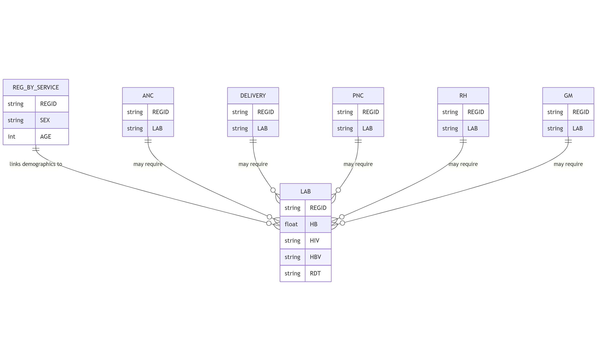

The `lab` table records laboratory tests performed in different healthcare services.

## Schema Definition

| Field Name | Data Type | Description |
|------------|-----------|-------------|
| ORGNAME | String | Name of the healthcare organization where the laboratory test was performed |
| REGID | String | Unique registration identifier linking to the reg_by_service table |
| CLINICNAME | String | Name of the specific clinic where the test was performed |
| TOWNSHIPNAME | String | Township name where the laboratory service was provided |
| VILLAGENAME | String | Village name where the laboratory service was provided |
| SEX | String | Gender of the patient |
| AGE | Integer | Age of the patient |
| AGEUNIT | String | Unit of measurement for age (e.g., Years, Months, Days) |
| PROVIDEDDATE | String | Date when the laboratory test was performed |
| PROVIDEDPLACE | String | Location type where the test was performed |
| RDT | String | Rapid Diagnostic Test results, typically for malaria |
| MICROSCOPIC | String | Microscopic examination results |
| HB | Float | Hemoglobin level in g/dL |
| BG | String | Blood group (e.g., A, B, AB, O) |
| RH | String | Rhesus factor (Positive or Negative) |
| UCG | String | Urine Pregnancy Test (hCG) results |
| URINESUGAR | String | Urinalysis result for glucose |
| URINEPROTEIN | String | Urinalysis result for protein |
| GONORRHOEA | String | Test result for gonorrhea |
| TRICHOMONUS | String | Test result for Trichomonas vaginalis |
| CANDIDA | String | Test result for Candida infection |
| REAGINTEST | String | Reagin test result for syphilis screening |
| TPHA | String | Treponema Pallidum Hemagglutination Assay result for syphilis confirmation |
| VDRL | String | Venereal Disease Research Laboratory test result for syphilis |
| HIV | String | Human Immunodeficiency Virus test result |
| HBV | String | Hepatitis B Virus test result |
| HCV | String | Hepatitis C Virus test result |
| SERVICESOURCE | String | Source of the laboratory service (e.g., routine care, outreach) |
| OTHERREMARK | Float | Additional remarks or notes about the laboratory tests |
| RBS | String | Random Blood Sugar test result |
| LABTEST | String | Other laboratory tests performed not covered by specific fields |

## Field Details

### Organizational and Demographic Information

**ORGNAME, CLINICNAME, TOWNSHIPNAME, VILLAGENAME**
These fields establish the organizational and geographic context of the laboratory testing.

**REGID**
This unique identifier links to the `reg_by_service` table, connecting laboratory data with the patient's demographic information and other healthcare services received.

**SEX, AGE, AGEUNIT**
These demographic fields record the patient's sex, age, and age unit.

**PROVIDEDDATE, PROVIDEDPLACE**
These fields document when and where the laboratory tests were performed.

### Hematology and Blood Typing Tests

**HB**
The hemoglobin level, measured in grams per deciliter (g/dL), is an indicator of anemia.

**BG, RH**
Blood group (ABO) and Rhesus factor testing are essential for blood transfusion compatibility and for identifying Rhesus incompatibility risk in pregnant women. BG typically contains values like 'A', 'B', 'AB', or 'O', while RH is recorded as 'Positive' or 'Negative'.

### Urinalysis

**UCG**
The Urine Pregnancy Test (Urine Chorionic Gonadotropin) result indicates pregnancy status. Results are typically recorded as 'Positive', 'Negative', or 'Indeterminate'.

**URINESUGAR, URINEPROTEIN**
These fields record urinalysis results for glucose and protein. Elevated glucose may indicate diabetes, while proteinuria can signal kidney disease or, in pregnant women, pre-eclampsia. Results are typically recorded on a scale (e.g., Negative, Trace, +, ++, +++).

### Infectious Disease Testing

**RDT, MICROSCOPIC**
These fields record malaria diagnostic test results. RDT refers to rapid diagnostic tests, while MICROSCOPIC refers to microscopic examination of blood smears. Results typically indicate the presence or absence of malaria parasites and, in the case of microscopy, may include the species and parasite density.

**GONORRHOEA, TRICHOMONUS, CANDIDA**
These fields document test results for common reproductive tract infections. Results are typically recorded as 'Positive', 'Negative', or 'Indeterminate'.

**REAGINTEST, TPHA, VDRL**
These fields record results of different syphilis testing methodologies.
- REAGINTEST: Non-treponemal screening test
- TPHA: Specific treponemal confirmation test
- VDRL: Another non-treponemal test used for syphilis screening and monitoring treatment response

Results are typically recorded as 'Reactive', 'Non-reactive', or with titer values for quantitative tests.

**HIV, HBV, HCV**
These fields document test results for bloodborne viral infections: Human Immunodeficiency Virus, Hepatitis B Virus, and Hepatitis C Virus. Results are typically recorded as 'Positive', 'Negative', or 'Indeterminate'.

### Metabolic Testing

**RBS**
The Random Blood Sugar test result measures blood glucose levels without regard to when the patient last ate. This test helps screen for diabetes or monitor glucose control. Results are typically recorded in mg/dL or mmol/L.

### Additional Information

**SERVICESOURCE**
This field records the service context in which the laboratory testing was performed, such as routine care, outreach services, or specialized clinics.

**OTHERREMARK**
This field allows for documentation of additional information, observations, or notes relevant to the laboratory testing encounter that may not fit into standardized fields.

**LABTEST**
This catch-all field documents other laboratory tests performed that are not captured in the specific test fields. This flexibility ensures that all diagnostic testing can be recorded, even as new tests are introduced or specialized testing is performed.

## Relationships with Other Tables

The primary relationship is through the REGID field, which links to the `reg_by_service` table for patient demographics. Additionally, the various service tables (ANC, DELIVERY, PNC, RH, GM) often reference laboratory testing in their LAB fields, which may provide summarized results or indicate that laboratory testing was ordered.