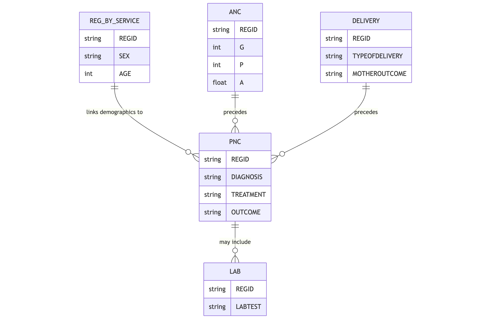

The `pnc` table stores data related to postnatal care services provided to mothers and newborns after childbirth. This table documents vital measurements, treatments, diagnoses, and other essential elements of care during the critical postnatal period.

## Schema Definition

| Field Name | Data Type | Description |
|------------|-----------|-------------|
| ORGNAME | String | Name of the healthcare organization providing the postnatal care service |
| REGID | String | Unique registration identifier linking to the reg_by_service table |
| CLINICNAME | String | Name of the specific clinic where the service was provided |
| TOWNSHIPNAME | String | Township name where the service was provided |
| VILLAGENAME | String | Village name where the service was provided |
| PROJECTNAME | String | Name of the project or program under which the service was provided |
| SEX | String | Gender of the patient, typically 'F' for maternal postnatal care |
| AGE | Integer | Age of the postnatal woman |
| AGEUNIT | String | Unit of measurement for age, typically 'Years' |
| PROVIDEDDATE | String | Date when the postnatal care service was provided |
| PROVIDEDPLACE | String | Location type where the service was provided (e.g., facility, home visit) |
| PROVIDERPOSITION | String | Role or position of the healthcare provider |
| ANSELFREP | Float | Self-reported number of antenatal care visits received during pregnancy |
| P | Integer | Parity - number of births past the age of viability |
| A | Float | Abortion - number of pregnancy losses before the age of viability |
| BP | String | Blood pressure measurement in mmHg format (e.g., "120/80") |
| TEMP | Float | Body temperature |
| TEMPUNIT | String | Unit of measurement for temperature (e.g., 'C' for Celsius) |
| PR | Float | Pulse rate in beats per minute |
| RR | Float | Respiratory rate in breaths per minute |
| LAB | String | Laboratory tests performed and their results |
| B1 | Float | Vitamin B1 supplements provided (quantity) |
| B1UNIT | String | Unit of measurement for vitamin B1 supplements |
| VITA | Float | Vitamin A supplements provided (quantity) |
| VITAUNIT | String | Unit of measurement for vitamin A supplements |
| FESO4 | Float | Iron supplements provided (quantity) |
| HE | String | Health education provided during the visit |
| OUTCOME | String | Outcome of the postnatal visit |
| REFTO | String | Facility referred to, if applicable |
| REFERRALTOOTHER | String | Other referral details |
| REFREASON | String | Reason for referral |
| DEATHREASON | String | Reason for death, if applicable |
| DELIVERYDATE | String | Date when the delivery occurred |
| TREATMENT | String | Treatments administered during the postnatal visit |
| OTHERTREATMENT | String | Additional treatments not covered in standard categories |
| DIAGNOSIS | String | Diagnoses identified during the postnatal visit |
| ERRORCOMMENTREMARK | String | Notes on any errors or special circumstances |
| PNFP | String | Family planning counseling provided during postnatal care |
| PNNBC | String | Newborn care counseling provided during postnatal care |
| MIGRANTWORKER | String | Flag indicating migrant worker status |
| DISABILITY | String | Flag indicating disability status |
| BSEX1 | String | Sex of first baby in case of multiple births |
| BSEX2 | String | Sex of second baby in case of multiple births |
| BSEX3 | String | Sex of third baby in case of multiple births |

## Field Details

### Organizational and Demographic Information

**ORGNAME, CLINICNAME, TOWNSHIPNAME, VILLAGENAME, PROJECTNAME**
These fields establish the organizational and geographic context of the postnatal care encounter.

**REGID**
This unique identifier links to the `reg_by_service` table, connecting postnatal care data with the mother's demographic information and other services received, particularly antenatal care and delivery services.

**SEX, AGE, AGEUNIT**
These demographic fields record the sex, age, and age unit of the mother.

**PROVIDEDDATE, PROVIDEDPLACE, PROVIDERPOSITION**
These fields document when and where the postnatal care was provided and by what type of healthcare worker.

### Maternal Health Assessment

**ANSELFREP**
This field records the number of antenatal care visits the woman reports having received during her pregnancy.

**P, A**
These standard obstetric notation fields document part of the woman's pregnancy history.
- P (Parity): Number of births of viable offspring
- A (Abortion): Number of pregnancy losses before viability

These fields provide context for interpreting postnatal health status and risks.

**BP, TEMP, TEMPUNIT, PR, RR**
These fields record the woman's vital signs during the postnatal visit, including blood pressure, temperature, pulse rate, and respiratory rate.

**LAB**
This field records laboratory tests performed during the postnatal visit and their results. Tests may include hemoglobin level to detect anemia, infection markers, or other diagnostics relevant to maternal postnatal health.

### Nutritional Support and Treatment

**B1, B1UNIT, VITA, VITAUNIT, FESO4**
These fields document nutritional supplements provided during the postnatal period.
- Vitamin B1 to support recovery and lactation
- Vitamin A to support immune function and vision
- Iron (FESO4) to prevent or treat anemia, which is common after childbirth

**TREATMENT, OTHERTREATMENT**
These fields record treatments administered during the postnatal visit, such as antibiotics for infection, analgesics for pain, or other medications addressing specific postnatal conditions.

**DIAGNOSIS**
This field captures medical diagnoses identified during the postnatal visit, such as puerperal infection, mastitis, postpartum hemorrhage, or other maternal health issues.

### Health Education and Counseling

**HE, PNFP, PNNBC**
These fields document health education and counseling provided during the postnatal visit.
- General health education (HE)
- Postnatal family planning counseling (PNFP)
- Newborn care counseling (PNNBC)

### Visit Outcomes and Referrals

**OUTCOME, REFTO, REFERRALTOOTHER, REFREASON, DEATHREASON**
These fields capture the outcome of the visit, including any referrals made to other facilities or specialists and the reasons for such referrals. In rare cases, if the outcome was maternal death, the cause is recorded.

### Delivery Context and Newborn Information

**DELIVERYDATE**
This field records the date of delivery.

**BSEX1, BSEX2, BSEX3**
These fields record the sex of each baby in case of multiple births.

### Additional Information

**ERRORCOMMENTREMARK**
This field allows for documentation of any errors, special circumstances, or additional information relevant to the postnatal care record.

**MIGRANTWORKER, DISABILITY**
These fields identify mothers belonging to specific vulnerable populations, enabling equity analysis and targeted support for these groups.

## Relationships with Other Tables

The primary relationship is through the REGID field, which links to the `reg_by_service` table for demographic information. The postnatal care record typically follows antenatal care and delivery records for the same woman. Laboratory tests recorded in the LAB field may have detailed results in the `lab` table.
