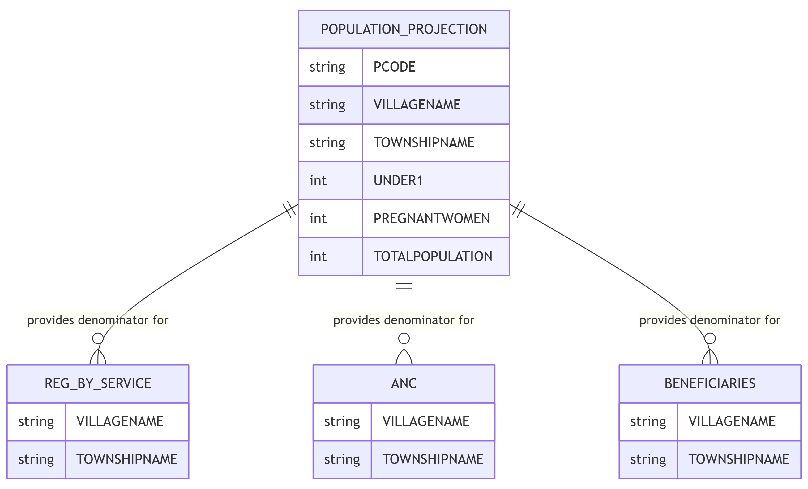

The `population_projection` table contains demographic data used for planning healthcare services and calculating coverage indicators within the Health Management Information System.

## Schema Definition

| Field Name | Data Type | Description |
|------------|-----------|-------------|
| ORGNAME | String | Name of the healthcare organization responsible for the data |
| REGID | String | Unique identifier for this population record |
| YEAR | Integer | Year for which the population data is reported |
| PCODE | String | Unique code identifying the geographical area |
| VILLAGENAME | String | Name of the village or community |
| TOWNSHIPNAME | String | Name of the township where the village is located |
| VTHC | String | Village Tract Health Center coverage indicator |
| UNDER1 | Integer | Total population of children under 1 year of age |
| AGE1TO2 | Integer | Total population of children 1-2 years of age |
| AGE2TO3 | Integer | Total population of children 2-3 years of age |
| AGE3TO4 | Integer | Total population of children 3-4 years of age |
| AGE5TO9 | Integer | Total population of children 5-9 years of age |
| AGE10TO14 | Integer | Total population of children 10-14 years of age |
| AGE15TO19 | Integer | Total population of adolescents 15-19 years of age |
| AGE20TO39 | Integer | Total population of adults 20-39 years of age |
| AGE40TO59 | Integer | Total population of adults 40-59 years of age |
| AGE60PLUS | Integer | Total population of adults 60 years and older |
| PREGNANTWOMEN | Integer | Estimated number of pregnant women |
| TOTALPOPULATION | Integer | Total population of all age groups combined |
| PROJECTNAME | String | Name of the project or program managing this data |
| ERRORCOMMENTREMARK | String | Notes on any errors or special circumstances |

## Field Details

### Organizational and Reference Information

**ORGNAME, REGID, PROJECTNAME**
These fields establish the organizational context for the population data and provide a unique identifier for each population record.

**YEAR**
This field specifies the year for which the population estimates are reported.

### Geographic Identification

**PCODE, VILLAGENAME, TOWNSHIPNAME**
These fields identify the specific geographic area for which population data is provided. The standardized geographical code (PCODE) enables consistent identification across different data systems, while the village and township names facilitate human-readable geographic analysis.

**VTHC**
This field indicates whether the village falls under the coverage area of a Village Tract Health Center.

### Age-Specific Population Counts

**UNDER1**
Population of infants under one year of age, critical for immunization planning and infant health services.

**AGE1TO2, AGE2TO3, AGE3TO4**
Population of young children in single-year age ranges, enabling precise targeting of early childhood interventions and developmental monitoring.

**AGE5TO9, AGE10TO14**
Population of school-age children, important for school health programs and pediatric service planning.

**AGE15TO19**
Population of adolescents, who have specific reproductive health education needs and developing healthcare requirements.

**AGE20TO39**
Population of younger adults, representing the primary reproductive age population with specific maternal health and family planning needs.

**AGE40TO59**
Population of middle-aged adults, who begin to experience increased prevalence of non-communicable diseases.

**AGE60PLUS**
Population of older adults, who require specific health services related to aging and chronic conditions.

### Special Population Groups and Summary

**PREGNANTWOMEN**
Estimated number of pregnant women in the geographic area, a critical population requiring specific antenatal, delivery, and postnatal services.

**TOTALPOPULATION**
The total population across all age groups, providing the overall denominator for health service planning.

### Additional Information

**ERRORCOMMENTREMARK**
This field allows for documentation of any errors, special circumstances, or additional information relevant to the population projection data.

## Relationships with Other Tables

While there may not be explicit foreign key relationships, the geographic fields in the `population_projection` table align with corresponding geographic identifiers in the service tables. This alignment enables calculation of coverage rates by matching service provision data with appropriate population denominators.