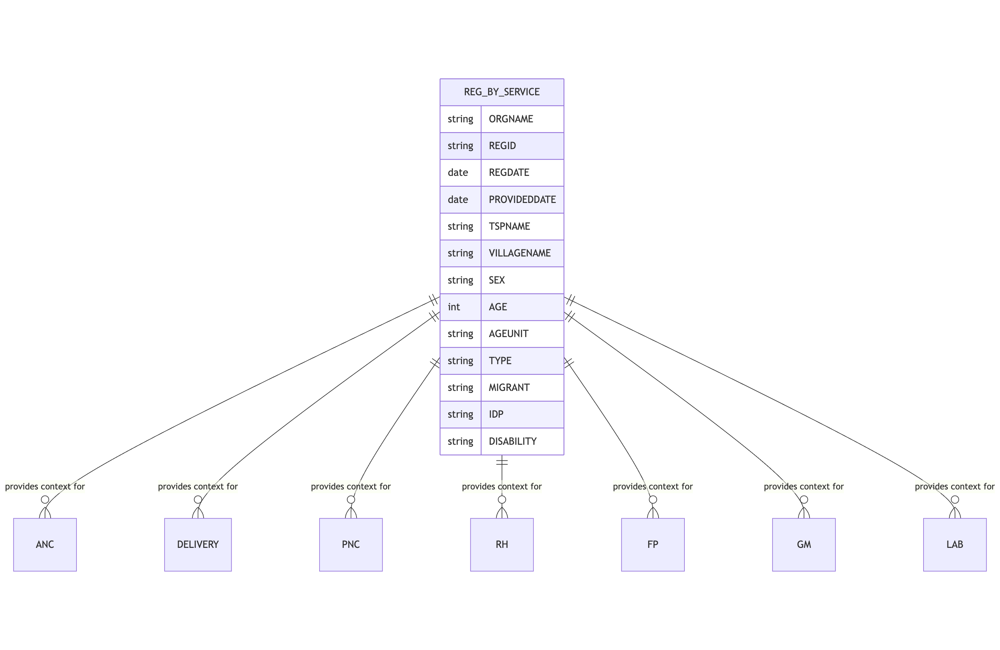

The `reg_by_service` table is the primary registry for individuals receiving healthcare services.

## Schema Definition

| Field Name | Data Type | Description |
|------------|-----------|-------------|
| ORGNAME | String | Name of the organization or health facility providing the service |
| REGID | String | Unique registration identifier for the individual receiving service; serves as the primary key and links to other service tables |
| REGDATE | Date | Date when the individual was initially registered in the system |
| PROVIDEDDATE | Date | Date when the specific healthcare service was provided |
| TSPNAME | String | Township name where the service was provided |
| VILLAGENAME | String | Village name where the service was provided |
| SEX | String | Gender of the individual, typically recorded as 'M' for male or 'F' for female |
| AGE | Integer | Numerical age value of the individual at the time of service |
| AGEUNIT | String | Unit of measurement for age, usually 'Years', 'Months', or 'Days' |
| TYPE | String | Type of healthcare service provided, such as 'ANC', 'PNC', 'GM', 'FP', etc. |
| MIGRANT | String | Flag indicating whether the individual is a migrant worker |
| IDP | String | Flag indicating whether the individual is an internally displaced person |
| DISABILITY | String | Flag indicating whether the individual has any form of disability |

## Field Details

### ORGNAME
This field stores the name of the healthcare organization or facility where the service was delivered. The organization name helps in identifying the service provider and enables analysis of healthcare delivery by organization.

### REGID
The registration identifier serves as the primary key for this table and creates relationships with other service tables. This unique identifier follows each individual throughout their interactions with the healthcare system, allowing for longitudinal tracking of care. The REGID is typically assigned at the first register and maintained across subsequent visits.

### REGDATE
The registration date records when the individual was first entered into the system. This field is valuable for analyzing patient inflow and system usage over time. The date is stored in a standard format (typically YYYY-MM-DD) to enable chronological sorting and date-based queries.

### PROVIDEDDATE
This field captures the actual date when the healthcare service was delivered. For returning patients, the PROVIDEDDATE will differ from the REGDATE, allowing for analysis of service frequency and patterns of health seeking behavior. Like REGDATE, this field follows a standard date format.

### TSPNAME and VILLAGENAME
These geographical identifiers record the township and village where the service was provided. These fields enable geographical analysis of service delivery and help identify areas with high or low service coverage. They can be used in conjunction with the Population Projection table to calculate service coverage rates.

### SEX
The sex field documents the gender of the individual receiving services. This demographic information is crucial for analyzing gender-specific health patterns and service utilization. The values typically include 'M' for male and 'F' for female.

### AGE and AGEUNIT
These fields record the individual's age at the time of service. The AGE field stores the numerical value, while AGEUNIT specifies the unit of measurement, which may be 'Years', 'Months', or 'Days'. This format accommodates precise age recording for infants and young children while remaining efficient for adults. These fields are essential for age-based analysis of health service utilization.

### TYPE
The service type field categorizes the specific healthcare service provided. Common values include

| Value | Description |
|-------|-------------|
| ANC | Antenatal Care |
| PNC | Postnatal Care |
| GM | General Medical |
| FP | Family Planning |
| RH | Reproductive Health |
| LAB | Laboratory Services |
| DEL | Delivery Services |

This field enables filtering and aggregation of services by type, facilitating service-specific analysis and reporting.

### MIGRANT, IDP, and DISABILITY
These three fields identify individuals belonging to specific vulnerable populations. Each field typically contains a 'Yes' or 'No' value (or equivalent), indicating the individual's status. These fields are crucial for monitoring healthcare equity and targeted interventions for vulnerable groups.

## Relationships with Other Tables

The `reg_by_service` table maintains relationships with other service-specific tables through the REGID field. These relationships are illustrated in the diagram below.

When a service is provided, a record is first created in the `reg_by_service` table, capturing the basic demographic information. Then, detailed service information is recorded in the appropriate service-specific table using the same REGID to maintain the relationship.
