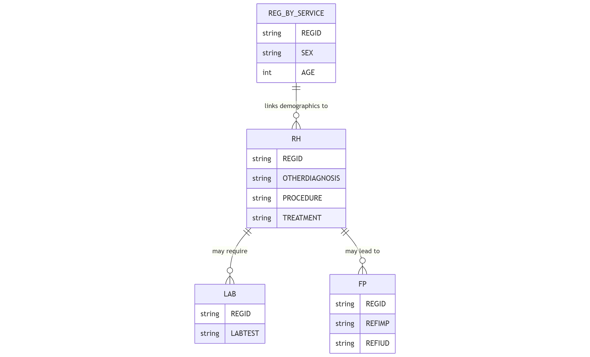

The `rh` table records reproductive health services beyond pregnancy-related care within the Health Management Information System.

## Schema Definition

| Field Name | Data Type | Description |
|------------|-----------|-------------|
| ORGNAME | String | Name of the healthcare organization providing the service |
| REGID | String | Unique registration identifier linking to the reg_by_service table |
| CLINICNAME | String | Name of the specific clinic where the service was provided |
| TOWNSHIPNAME | String | Township name where the service was provided |
| VILLAGENAME | String | Village name where the service was provided |
| PROJECTNAME | String | Name of the project or program under which the service was provided |
| SEX | Integer | Gender of the patient (encoded as numeric value) |
| AGE | String | Age of the patient |
| AGEUNIT | String | Unit of measurement for age (e.g., Years, Months, Days) |
| PROVIDEDDATE | String | Date when the service was provided |
| PROVIDEDPLACE | String | Location type where the service was provided |
| PROVIDERPOSITION | Float | Role or position of the healthcare provider (encoded as numeric value) |
| WT | Float | Weight of the patient in kilograms |
| HT | String | Height of the patient in centimeters |
| BP | String | Blood pressure measurement in mmHg format (e.g., "120/80") |
| PR | Integer | Pulse rate in beats per minute |
| RR | Integer | Respiratory rate in breaths per minute |
| TEMP | Float | Body temperature |
| TEMPUNIT | String | Unit of measurement for temperature (e.g., 'C' for Celsius) |
| PREGNANCY | Float | Pregnancy status assessment |
| P | Float | Parity - number of births past the age of viability |
| A | String | Abortion - number of pregnancy losses before the age of viability |
| PAC | String | Post-abortion care provided |
| OTHERDIAGNOSIS | String | Diagnoses identified during the visit |
| PROCEDURE | String | Procedures performed during the reproductive health visit |
| TREATMENT | String | Treatments or medications provided |
| LAB | String | Laboratory tests performed and their results |
| OUTCOME | String | Outcome of the reproductive health visit |
| REFTO | String | Facility referred to, if applicable |
| REFREASON | String | Reason for referral |
| REFERRALTOOTHER | String | Other referral details |
| DEATHREASON | String | Reason for death, if applicable |
| ERRORCOMMENTREMARK | String | Notes on any errors or special circumstances |
| MIGRANTWORKER | String | Flag indicating migrant worker status |
| IDP | String | Flag indicating internally displaced person status |
| DISABILITY | String | Flag indicating disability status |

## Field Details

### Organizational and Demographic Information

**ORGNAME, CLINICNAME, TOWNSHIPNAME, VILLAGENAME, PROJECTNAME**
These fields establish the organizational and geographic context of the reproductive health service.

**REGID**
This unique identifier links to the `reg_by_service` table, connecting reproductive health data with the patient's demographic information and other healthcare services received.

**SEX, AGE, AGEUNIT**
These demographic fields record the patient's sex, age, and age unit.

**PROVIDEDDATE, PROVIDEDPLACE, PROVIDERPOSITION**
These fields document when and where the service was provided and by what type of healthcare worker.

### Physical Assessment

**WT, HT, BP, PR, RR, TEMP, TEMPUNIT**
These fields record the patient's physical measurements and vital signs during the reproductive health visit.

### Reproductive Health Specific Information

**PREGNANCY**
This field records the assessment of pregnancy status.

**P, A**
These standard obstetric notation fields document the woman's pregnancy history.
- P (Parity): Number of births past the age of viability
- A (Abortion): Number of pregnancy losses before viability

**PAC**
This field documents post-abortion care services provided, which may include treatment for incomplete abortion, counseling, contraceptive services, and other supportive care.

### Clinical Assessment and Management

**OTHERDIAGNOSIS**
This field captures reproductive health-related diagnoses identified during the visit, such as sexually transmitted infections, reproductive tract infections, menstrual disorders, or other conditions.

**PROCEDURE**
This field documents clinical procedures performed during the reproductive health visit, which may include cervical screening, biopsies, cryotherapy, or other gynecological procedures.

**TREATMENT**
This field records medications prescribed, therapies provided, or other therapeutic interventions implemented during the reproductive health visit.

**LAB**
This field documents laboratory tests ordered or performed as part of the reproductive health assessment, such as STI testing, pap smears, or other diagnostic studies.

### Outcomes and Referrals

**OUTCOME**
This field captures the immediate outcome of the reproductive health visit, such as improved, stable, deteriorated, or other status indicators.

**REFTO, REFREASON, REFERRALTOOTHER**
These fields document referrals to other healthcare services or specialists, including the destination and clinical rationale for the referral.

**DEATHREASON**
In the event of patient death related to reproductive health conditions, this field records the clinical cause.

### Vulnerability Indicators

**MIGRANTWORKER, IDP, DISABILITY**
These fields identify patients belonging to specific vulnerable populations.

### Additional Information

**ERRORCOMMENTREMARK**
This field allows for documentation of any errors, special circumstances, or additional information relevant to the reproductive health visit.

## Relationships with Other Tables

The primary relationship is through the REGID field, which links to the `reg_by_service` table for patient demographics. Laboratory tests recorded in the LAB field may have detailed results in the `lab` table. Additionally, reproductive health services may lead to family planning services, creating a relationship with the `fp` table.