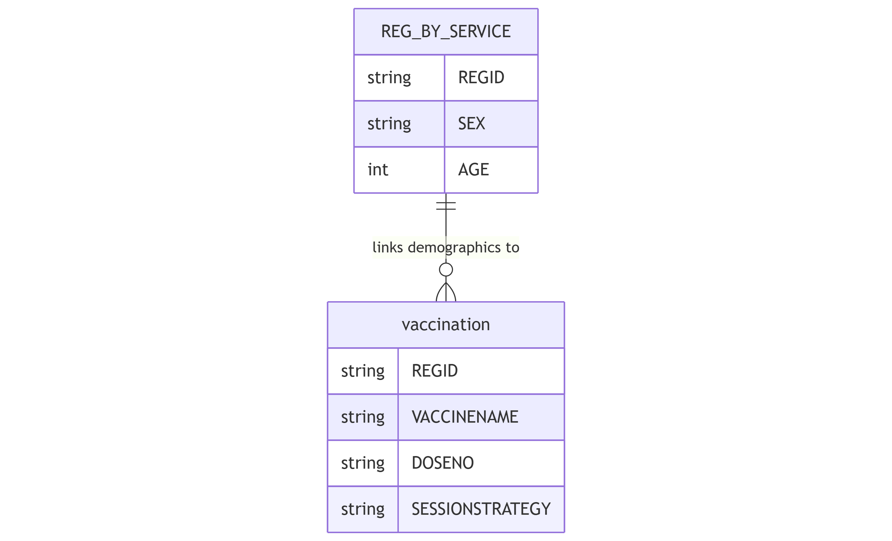

The `vaccination` table records individuals who have received vaccination services within the Health Management Information System.

## Schema Definition

| Field Name | Data Type | Description |
|------------|-----------|-------------|
| ORGNAME | String | Name of the healthcare organization providing the vaccination service |
| REGID | String | Unique registration identifier linking to the reg_by_service table |
| CLINICNAME | String | Name of the specific clinic where the vaccination was provided |
| TOWNSHIPNAME | String | Township name where the vaccination was provided |
| VILLAGENAME | String | Village name where the vaccination was provided |
| PROJECTNAME | String | Name of the project or program under which the service was provided |
| SEX | String | Gender of the beneficiary |
| AGE | Integer | Age of the beneficiary |
| AGEUNIT | String | Unit of measurement for age (e.g., Years, Months, Days) |
| PROVIDEDDATE | String | Date when the vaccination was provided |
| PROVIDEDPLACE | String | Location type where the vaccination was provided |
| PROVIDERPOSITION | String | Role or position of the healthcare provider |
| PREGNANCY | String | Flag indicating pregnancy status |
| IDP | String | Flag indicating internally displaced person status |
| DISABILITY | String | Flag indicating disability status |
| CONFLICTAREA | String | Flag indicating residence in conflict-affected area |
| HFNAME | String | Name of the health facility where vaccination was provided |
| VACCINETYPE | String | Type or brand of vaccine administered |
| SESSIONID | String | Unique identifier for the vaccination session |
| SESSIONNAME | String | Name or description of the vaccination session |
| SESSIONSTRATEGY | String | Approach used for vaccine delivery (e.g., fixed post, outreach) |
| VENUENAME | String | Specific location where vaccination was provided |
| VACCINENAME | String | Name of the specific vaccine administered |
| LOTNO | String | Lot or batch number of the vaccine |
| DOSENO | String | Dose number in the vaccination sequence |
| VACCINATORNAME | String | Name of the healthcare worker who administered the vaccine |
| ERRORCOMMENTREMARK | String | Notes on any errors or special circumstances |
| MIGRANTWORKER | String | Flag indicating migrant worker status |

## Field Details

### Organizational and Geographic Information

**ORGNAME, CLINICNAME, TOWNSHIPNAME, VILLAGENAME, PROJECTNAME**
These fields establish the organizational and geographic context of the vaccination service, enabling analysis across different implementing partners, facilities, and regions.

**REGID**
This unique identifier links to the `reg_by_service` table, connecting vaccination data with the beneficiary's demographic information and other healthcare services received.

### Demographic Information

**SEX, AGE, AGEUNIT**
These fields record the beneficiary's sex, age, and age unit.

**PREGNANCY, IDP, DISABILITY, CONFLICTAREA, MIGRANTWORKER**
These vulnerability indicators identify vaccination belonging to specific groups that may face barriers to vaccination access.

### Service Delivery Information

**PROVIDEDDATE, PROVIDEDPLACE, PROVIDERPOSITION**
These fields document when and where the vaccination was provided and by what type of healthcare worker.

**HFNAME, VENUENAME**
These fields record the health facility and specific venue responsible for providing the vaccination.

### Vaccination Details

**VACCINETYPE, VACCINENAME**
These complementary fields record the type and specific name of the vaccine administered.

**LOTNO**
This field captures the manufacturing lot or batch number of the administered vaccine.

**DOSENO**
This field records which dose in a multi-dose vaccine sequence was administered.

### Session Information

**SESSIONID, SESSIONNAME, SESSIONSTRATEGY**
These fields document the vaccination session details, including the service delivery approach used.

**VACCINATORNAME**
This field records the healthcare worker who administered the vaccine.

### Additional Information

**ERRORCOMMENTREMARK**
This field allows for documentation of any errors, special circumstances, or additional information relevant to the vaccination event.

## Relationships with Other Tables

The primary relationship is through the REGID field, which links to the `reg_by_service` table for beneficiary demographics.