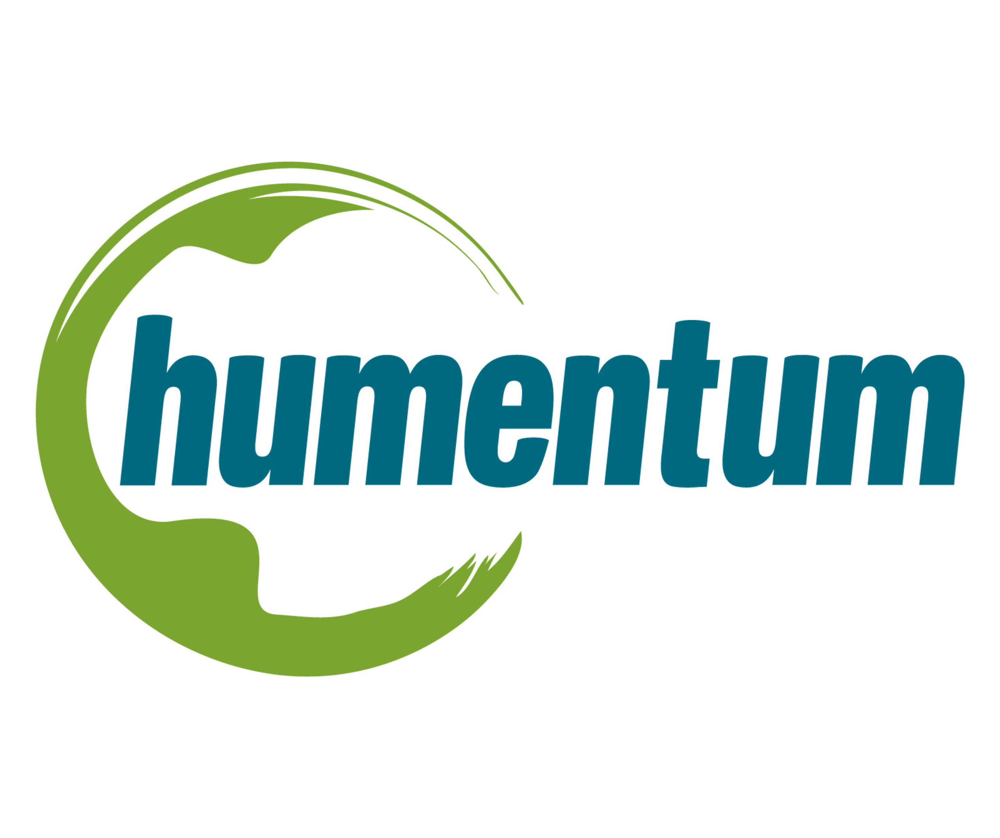
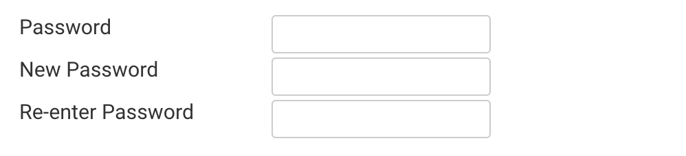

Humentum ရဲ့ NGO သင်တန်းတွေဟာ USAID အသိအမှတ်ပြုသင်တန်းတွေဖြစ်ပြီး USAID Grant တွေရယူတဲ့အခါမျိုးမှာ လိုက်လျောညီထွေဖြစ်စေမယ့် သင်ခန်းစာတွေထည့်သွင်းထားပါတယ်။ NGO အလုပ်မှာ မိမိ career ကိုတည်ဆောက်ဖို့ရည်ရွယ်ထားတယ်ဆိုရင် Humentum သင်တန်းတွေကိုတက်ထားသင့်ပါတယ်။

**Humentum DPro Suite** တွေဟာ တက်ရောက်သူအများဆုံးသင်တန်းတွေဖြစ်ပါတယ်။ Humentum.org မှာ DPro Suite သင်တန်းတစ်ခုချင်းစီကုန်ကျစရိတ်ကို အောက်ပါဇယားကနေဝင်ရောက်လေ့လာနိုင်ပါတယ်။

|Suite|Link|
|--|--|
|Project DPro|[Visit](https://humentum.org/courses/project-management-for-development-professionals-project-dpro/)|
|Program DPro|[Visit](https://humentum.org/courses/program-management-for-development-professionals-program-d-pro/)|
|MEAL DPro|[Visit](https://humentum.org/courses/monitoring-evaluation-accountability-and-learning-meal-dpro-2/)|
|Finance DPro|[Visit](https://humentum.org/courses/financial-management-for-development-professionals-finance-dpro/)|

အထက်ပါ DPro Suite သင်တန်းတွေအပါအဝင် အခြား Humentum Course တွေကို EHSSG က မိတ်ဖက်အဖွဲ့အစည်းတွေအတွက် ဝယ်ယူပေးထားတာကြောင့် **အခမဲ့** ဝင်ရောက်လေ့လာနိုင်မှာဖြစ်ပြီး သင်တန်းပြီးဆုံးတဲ့အခါမှာလည်း Humentum ကပေးတဲ့ Certificate ကိုပါ **အခမဲ့** ရယူနိုင်မှာဖြစ်ပါတယ်။

## Application form
EHSSG ရဲ့မိတ်ဖက်အဖွဲ့အစည်းများအတွက် အဓိကရည်ရွယ်တဲ့ သင်တန်းတွေဖြစ်တာကြောင့် လူတိုင်း Register ပြုလုပ်ရန်ဖွင့်ပေးထားခြင်းမရှိဘဲ သင်တန်းတက်ရောက်ဖို့ application form ကိုဦးစွာဖြည့်ပေးဖို့လိုပါတယ်။

[Application Form ဖြည့်ရန်](https://forms.gle/4793RQqKm2GzMRmb9)

:::note
EHSSG website https://ehssg.org မှာ `Courses/Humentum Courses/Apply for Humentum Courses` ကနေလည်း application form ကိုဖြည့်လို့ရပါတယ်
:::

Application Form မှာပါဝင်တဲ့အချက်များ
* **အမည်**
    * မိမိအမည်အရင်း၊ certificate မှာပါစေချင်တဲ့နာမည်အတိုင်း ***အင်္ဂလိပ်ဘာသာဖြင့်*** ထည့်ပေးရပါမယ်၊ နောက်ပိုင်းမှာနာမည်ပြန်ပြောင်းလို့ရပေမယ့် သင်တန်းတစ်ခု enroll စလုပ်တဲ့အချိန်မှာရှိခဲ့တဲ့နာမည်ကို တခါတည်းမှတ်ထားတာမို့လို့ ကြားထဲမှာနာမည်ပြန်ပြောင်းပေမယ့်လည်း certificate ထုတ်တဲ့အချိန်မှာ မူလနာမည်နဲ့ပဲထွက်တာမို့လို့ပါ
* **Email**
    * အလုပ်အတွက်အီးမေးပဲဖြစ်ဖြစ်၊ ပုဂ္ဂလိကအီးမေးလ်ပဲဖြစ်ဖြစ် ထည့်နိုင်ပါတယ်။ password မေ့ရင် reset link လှမ်းပို့မှာမို့လို့ sign in ဝင်လို့ရပြီး storage လည်းပြည့်မနေတဲ့ အီးမေးလ်ဖြစ်ရင်ရပါပြီ
* **မိတ်ဖက်အဖွဲ့အစည်း**
    * အဖွဲ့အစည်းနာမည်ကိုရွေးပါ။ EHSSG မိတ်ဖက်အဖွဲ့အစည်းတွေကို အဓိကထည့်သွင်းထားတာမို့လို့ မိမိအဖွဲ့အစည်းနာမည်မပါခဲ့ရင် `info@ehssg.org` ကိုဆက်သွယ်လို့ရပါတယ်
* **ရာထူး/တာဝန်**
    * လက်ရှိထမ်းဆောင်နေတဲ့ ရာထူး/တာဝန်ကိုထည့်သွင်းပါ၊ အင်္ဂလိပ်ဘာသာဖြင့်ထည့်သွင်းဖို့လိုပါတယ်
* **တက်ရောက်လိုသည့်သင်တန်း**
    * တစ်ခုထက်ပိုပြီးရွေးနိုင်ပါတယ်။ သင်တန်းစာရင်းအပြည့်အစုံကို [ဤနေရာမှာ](https://drive.google.com/file/d/1u8W1MIKO_hn7OVEKYu60tIR7Mttk2w_0/view) ကြည့်နိုင်ပါတယ်။ တချို့သင်တန်းတွေက တက်လို့မရသေးပေမယ့် နောက်နှစ်တွေမှာသင်တန်းတွေထပ်ဝယ်ဖြစ်တယ်ဆိုရင် အများဆုံးတက်ချင်တဲ့အတန်းတွေကို ဦးစားပေးဝယ်ဖို့အတွက်ပါ

အားလုံးဖြည့်ပြီးသွားရင်တော့ application form ကို submit လုပ်လို့ရပါပြီ

## How you will get approved
Application form တွေကို တစ်ပတ်လျှင်အနည်းဆုံးတစ်ကြိမ် စိစစ်ပေးပြီး သက်ဆိုင်ရာအဖွဲ့အစည်းရဲ့ဝန်ထမ်းဟုတ်မဟုတ်ကိုပါ စစ်ဆေးတာမို့လို့ စတင်လျှောက်ထားတဲ့အချိန်ကနေ တစ်ပတ်မှနှစ်ပတ်အတွင်း အကြောင်းကြားစာလက်ခံရရှိနိုင်မှာဖြစ်ပါတယ်။ အကြောင်းကြားစာကို မိမိထည့်သွင်းခဲ့တဲ့ အီးမေးလ်လိပ်စာကိုပဲ ပေးပို့မှာဖြစ်ပြီး application form ကိုအတည်ပြုသည်ဖြစ်စေ၊ ငြင်းပယ်ခံရသည်ဖြစ်စေ အကြောင်းကြားပေးမှာဖြစ်ပါတယ်။

## Getting your login credentials
Application form ကိုအတည်ပြုပြီးတာနဲ့ သင်တန်းဝင်ရောက်လေ့လာဖို့ account တစ်ခုကို EHSSG ကပြုလုပ်ပေးပါမယ်။ Login ဝင်ရန်အီးမေးလ်လိပ်စာဟာ မိမိပေးထားတဲ့လိပ်စာပဲဖြစ်ပြီး ယာယီ password တစ်ခုကိုပါ ပေးပို့အကြောင်းကြားမှာဖြစ်ပါတယ်။

[Humentum LMS သို့သွားရန်](https://lingos.netdimensions.com/)

Email နဲ့ ယာယီ password ကိုသုံးပြီး login ဝင်လိုက်တာနဲ့ password ပြောင်းရမယ့်စာမျက်နှာကိုရောက်ပါမယ်။

**Password** မှာယာယီ password ထည့်ပါ

**New Password** မှာ မိမိပေးချင်တဲ့ password ထည့်ပါ

**Re-enter Password** မှာ မိမိပေးချင်တဲ့ password ကိုနောက်တစ်ကြိမ်ထပ်မံထည့်ပါ

Password အသစ်နဲ့နောက်တစ်ကြိမ်ထပ်မံ login ဝင်ရောက်ပြီး သင်တန်းများစတင်လေ့လာနိုင်ပါပြီ။