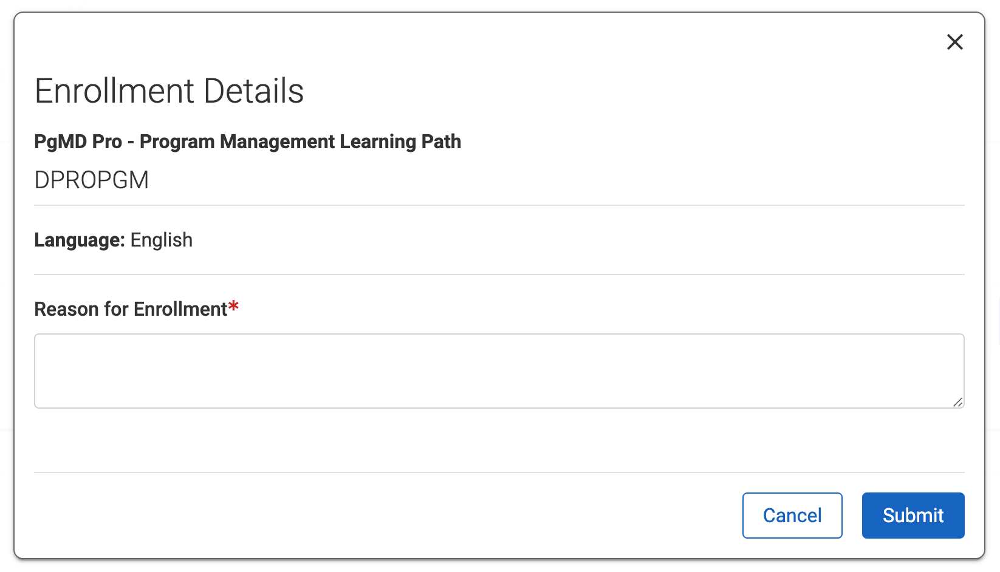

Login ဝင်လိုက်တာနဲ့ Home စာမျက်နှာကိုရောက်ပါမယ်။ Home ထဲက **Catalog** မှာ သင်တန်းတွေကိုဝင်ကြည့်လို့ရပါတယ်

## Course Catalog
EHSSG နာမည်နဲ့ Catalog ထဲကိုဝင်လိုက်ရင် Humentum နဲ့ အခြားကုမ္ပဏီတွေဆီက သင်တန်းတွေကို အုပ်စုလိုက်စုစည်းထားတာ တွေ့ရပါမယ်။ သင်တန်း website နဲ့ course catalog ကို Humentum ကပဲ EHSSG ကိုဖန်တီးပေးထားပါတယ်။ ဒါကြောင့် catalog ထဲမှာ EHSSG က ဝယ်ထားတဲ့ course တွေကော၊ မဝယ်ထားတဲ့ course တွေပါမြင်နေရပါတယ်။

:::note
Humentum course တွေကို pre-paid စနစ်နဲ့ကြိုဝယ်ထားတာဖြစ်ပြီး Humentum မဟုတ်တဲ့ course တွေကိုတော့ pay-as-you-go စနစ်နဲ့ သင်တန်းတက်ရင်တက်သလောက် ကောက်ခံပါတယ်။ ဒါကြောင့် Humentum တံဆိပ်ပါတဲ့သင်တန်းအားလုံးဟာ တက်လို့ရတဲ့သင်တန်းတွေဖြစ်ပါတယ်။ Humentum မဟုတ်တဲ့ *Cegos* ၊ *Skillsoft* စတာတွေဟာ EHSSG ဝယ်ထားတဲ့အထဲမှာ မပါလို့ လောလောဆယ်တက်လို့မရသေးပါဘူး
:::

## How to enroll courses
Humentum တံဆိပ်ပါတဲ့အထဲက တက်ချင်တဲ့ course ကိုဝင်ပါ။ Course တစ်ခုစီမှာ **Learning Pathway** နဲ့ *Module* တွေကိုယ်စီရှိကြပါတယ်။ သင်တန်းလေ့လာတော့မယ်ဆိုရင် **Learning Pathway** ကိုရှာနှိပ်ပါ။ Learning Pathway စာမျက်နှာရောက်ရင် **Enroll** ခလုတ်ကိုနှိပ်ပါ။

:::note
Module တစ်ခုချင်းစီသွားပြီး Enroll နှိပ်ရင်ရပေမယ့် Module တစ်ခုပြီးတိုင်း နောက်တစ်ခုကို Enroll ထပ်လုပ်နေရပါလိမ့်မယ်။ Module တွေအားလုံးပြီးသွားပေမယ့်လည်း Module တစ်ခုချင်းစီရဲ့ certificate ပဲထုတ်ယူလို့ရပြီး course တစ်ခုလုံးရဲ့ certificate ဟာ Learning Pathway enroll လုပ်ထားမှထုတ်ယူလို့ရပါတယ်။ Learning pathway ကိုစစချင်းမှာ enroll လုပ်လိုက်တာနဲ့ module တွေအားလုံးတခါတည်း enroll လုပ်ပြီးသားဖြစ်ပါတယ်
:::

Enroll ခလုတ်နှိပ်လိုက်ပြီဆိုတာနှင့် enrollment detail စာမျက်နှာကိုရောက်ပါမယ်။ *Reason for enrollment* မှာတစ်ခုခုရေးခဲ့ပြီး **Submit** နှိပ်ပါ။ Pre-paid course တွေကော၊ Pay-as-you-go course တွေကိုပါ Humentum ကပြပေးတာမို့လို့ enrollment အဆင့်ကိုပါ approval ခံထားရတာဖြစ်ပါတယ်။

Course တစ်ခုချင်းစီမှာ Enrollment approval ရပြီဆိုတာနဲ့ *Pending approval* စာသားကနေ **Not Started** (သို့) **In Process** အဖြစ်ပြောင်းသွားပါလိမ့်မယ်