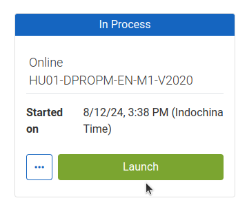

## Launching Courses
Course တစ်ခုကိုစတင်လေ့လာတော့မယ်ဆိုရင် Catalog ထဲကနေ Module တစ်ခုချင်းစီသွားမနှိပ်ဘဲ **Learning Pathway** ကိုပဲ အရင်သွားပါ။

Learning Pathway ထဲရောက်ရင် *Course Details* နဲ့ *Program Structure* ဆိုတဲ့ tab နှစ်ခုတွေ့ရပါမယ်။ **Program Structure** tab ထဲကိုဝင်ပါ။

Learning Pathway ထဲမှာရှိတဲ့ Module တွေကိုတွေ့ရပါမယ်။ မိမိလေ့လာချင်တဲ့ module ကိုနှိပ်ပါ။

ညာဘက်အစွန်က **Launch** ခလုတ်ကိုနှိပ်ပါ

:::note
[Launch ခလုတ်ရှာမတွေ့လျှင်ပြုလုပ်ရန်](#launch-button-not-visible)
:::

စာမျက်နှာအသစ်တစ်ခုပွင့်လာပြီး Module အလိုက်လေ့လာနိုင်မှာဖြစ်ပါတယ်။

## Resuming Courses
လေ့လာနေဆဲသင်ခန်းစာတွေကို နောက်ဆုံးရောက်ခဲ့တဲ့နေရာကနေ ပြန်ဝင်လို့ရပါတယ်။ DPro သင်ခန်းစာအမျိုးအစားတွေမှာ Module တွေခွဲထားလေ့ရှိပြီး Module တစ်ခုပြီးမှနောက်တစ်ခုဆက်တက်ရမယ်လို့ ကန့်သတ်ထားတာမရှိပါဘူး။ ဘယ် module ကိုပဲဝင်ဝင် ရောက်တဲ့နေရာကနေ ဆက်လေ့လာလို့ရပါတယ်။ Course တစ်ခုမှာ enroll လုပ်လိုက်ပြီဆိုတာနဲ့ **Home** စာမျက်နှာမှာ *Current Courses* ဆိုပြီးပြပေးပါလိမ့်မယ်။

Course ထဲကိုဝင်ကြည့်လိုက်မယ်ဆိုရင် *Course Details* နဲ့ *Program Structure* ဆိုတဲ့ tab နှစ်ခုတွေ့ရပါမယ်။ **Program Structure** tab ထဲကိုဝင်ပါ။

Learning Pathway ထဲမှာရှိတဲ့ Module တွေကိုတွေ့ရပါမယ်။ မိမိလေ့လာချင်တဲ့ module (သို့) လေ့လာဆဲ module ကိုနှိပ်ပါ။

ညာဘက်အစွန်က **Launch** ခလုတ်ကိုနှိပ်ပါ

:::note
[Launch ခလုတ်ရှာမတွေ့လျှင်ပြုလုပ်ရန်](#launch-button-not-visible)
:::

လေ့လာလက်စနေရာကနေ ဆက်တက်လို့ရနေမှာဖြစ်ပါတယ်

:::note
DPro သင်တန်းတွေကို Module တွေခွဲထားပြီး Module တစ်ခုပြီးမှ နောက်တစ်ခုဆက်လေ့လာရမယ်လို့ ကန့်သတ်ထားတာမရှိပါဘူး။ module တစ်ခုမပြီးသေးခင် နောက်တစ်ခုစတက်ထားလို့ရတယ်ဆိုပေမယ့် သင်ခန်းစာသဘောတရားအရ အခြေခံပြီးမှသာ နောက်တစ်ခုကိုဆက်လေ့လာတာ ပိုသင့်တော်ပါတယ်။
:::

## Getting Certificate
Module တွေအားလုံးပြီးသွားတဲ့အခါ Module တစ်ခုချင်းအတွက် certificate ထုတ်လို့ရသလို Module အားလုံးပေါင်းထားတဲ့ Learning Pathway တစ်ခုလုံးစာအတွက်လည်း certificate ရယူနိုင်ပါတယ်။

Top Menu က **Learning Center** အောက်က **Certifications** ကိုသွားပါ။ မိမိလတ်တလောပြီးထားတဲ့ certificate တွေကိုမြင်ရပါမယ်။ certificate အားလုံးကိုပေါ်စေချင်ရင် *Status* မှာ **All** ကိုရွေးပါ။

Certificate ထုတ်ယူတဲ့အခါမှာ module (သို့) Learning Pathway ရဲ့ ဘယ်ဘက်အစွန်က *Setting* ကိုနှိပ်ပြီး **Print** ကိုရွေးပါ

*Download* ခလုတ်ကိုနှိပ်ပြီး PDF format နဲ့ Download လုပ်နိုင်ပါပြီ

## Launch button not visible
Certificate ထုတ်ပြီးသား course တွေနဲ့ module တွေကိုပြန်ဖတ်ချင်တာ၊ ရောက်တဲ့နေရာကနေ ပြန်ဝင်ဖတ်ချင်တဲ့အခါမျိုးမှာ Launch ခလုတ်ရှာလို့မတွေ့တာမျိုးဖြစ်တတ်ပါတယ်။

တွေ့နေကျ Launch နေရာမှာ **Knowledge Center** ပဲပေါ်နေတာကိုနှိပ်ပါ

နောက်ပေါ်လာတဲ့စာမျက်နှာမှာ **Launch** ခလုတ်ကိုနှိပ်ပြီးဖွင့်နိုင်ပါတယ်

