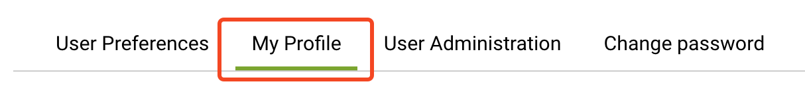
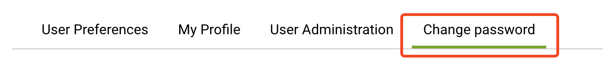
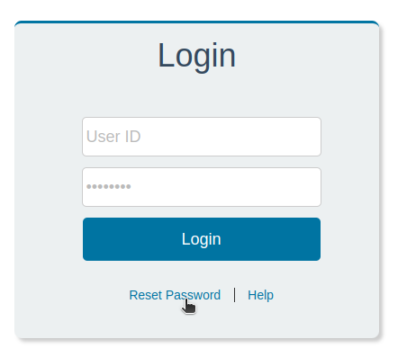

## Viewing Profile
Website ညာဘက်အပေါ်ထောင့်မှာ မိမိရဲ့ Username ကိုနှိပ်ပါ။ **My Profile** ကိုသွားပါ

**My Profile** tab ထဲကိုဆက်ဝင်ပြီး profile ကိုကြည့်နိုင်ပါတယ်

### Changing Email and Username
မိမိ Email နဲ့ Username ပြောင်းလဲခွင့်ကို Humentum ကမဖွင့်ပေးထားလို့ Email အသစ်ပြောင်းချင်တာ၊ နာမည်ပြောင်းချင်တာရှိရင် `info@ehssg.org` ကိုဆက်သွယ်နိုင်ပါတယ်

### Changing Password
Password ပြောင်းလဲဖို့ **Change Password** tab ကိုဖွင့်ပါ

## Forgot Passwords
Password မေ့သွားလို့ login ဝင်လို့မရတော့တဲ့အခါ Login စာမျက်နှာမှာ **Reset Password** ကိုနှိပ်ပါ

### Reset Password
Reset Password နှိပ်လိုက်ရင် စာမျက်နှာအသစ်တစ်ခုပွင့်လာပါမယ်။
* **Email**
    * application form ဖြည့်တုန်းကပေးထားတဲ့ အီးမေးလ်အတိုင်းထည့်ပါ
* **User ID**
    * အပေါ်ကအီးမေးလ်ကိုပဲနောက်တစ်ခေါက်ထပ်ထည့်ပါ

**Reset** ခလုတ်ကိုနှိပ်ပါ

နောက်စာမျက်နှာမှာ **Continue** နှိပ်ပါ

မကြာမီ အီးမေးလ်ဝင်လာပါလိမ့်မယ်။ အီးမေးလ်ထဲက **Reset your password** ကိုနှိပ်ပါ

**New Password** နဲ့ **Re-enter Password** မှာ password အသစ်ကိုထည့်ပေးပါ။ **Submit** နှိပ်ပြီး login ပြန်ဝင်နိုင်ပါတယ်

### Request to reset password
Humentum courses password လည်းမေ့နေပြီး password reset email ကိုပါဝင်လို့မရတော့ဘူးရင် `info@ehssg.org` ကိုဆက်သွယ်ပြီး password ပြန်လည်တောင်းယူနိုင်ပါတယ်။