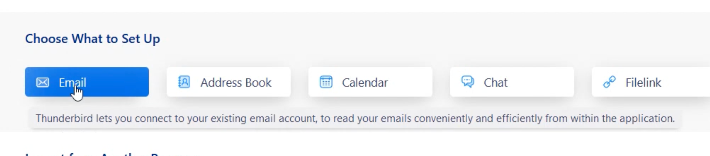

Email အသုံးပြုနိုင်တဲ့နည်း (၃) နည်းရှိပါတယ်။
> 1. Webmail
> 2. Desktop Mail Client
> 3. Mobile Mail Client

Webmail က အီးမေးကိုအင်တာနက်ဘရောက်ဇာကနေ တိုက်ရိုက်ဝင်ကြည့်တာဖြစ်ပါတယ်။ မေးလ်ဆာဗာပေါ်မှာသိမ်းထားတဲ့ အီးမေးလ်တွေကို အင်တာနက်ရတဲ့အချိန်မှာ ဖတ်ခြင်း၊ ပို့ခြင်းပြုလုပ်နိုင်ပြီး အသုံးပြုနေတဲ့ကွန်ပြူတာ (သို့) မိုဘိုင်းစက်ပစ္စည်းထဲမှာ သိမ်းဆည်းထားခြင်းမရှိပါဘူး။ အင်တာနက်နဲ့ ဘရောက်ဇာရှိတာနဲ့ ဝင်သုံးလို့ရတာမို့လို့ ကွန်ပြူတာဖြစ်ဖြစ်၊ ဖုန်း/တက်ဘလက်မှာပဲဖြစ်ဖြစ် အသုံးပြုပုံချင်းအတူတူဖြစ်ပါတယ်။ အားနည်းချက်ကတော့ အင်တာနက်မရရင် အသုံးမပြုနိုင်တော့ဘဲ လက်ခံလည်းမကျန်ခဲ့တာကြောင့် အင်တာနက်မရတဲ့အချိန် အရင်ကအီးမေးလ်တွေပြန်ကြည့်လို့မရနိုင်ပါဘူး။ အီးမေးလ်အသစ်ဝင်လာတဲ့အခါမှာလည်း notification တက်မှာမဟုတ်ပါဘူး။

Desktop နဲ့ Mobile mail client တွေကတော့ ကွန်ပြူတာ (သို့) ဖုန်း/တက်ဘလက်မှာထည့်သွင်းထားတဲ့  အီးမေးလ်အပလီကေးရှင်းကတဆင့် ဆာဗာကိုချိတ်ဆက်တာဖြစ်ပါတယ်။ ကနဦးစတင်ချိတ်ဆက်တဲ့အခါမှာ လုပ်ဆောင်ရတဲ့အဆင့်တွေပိုများပေမယ့် နောက်ပိုင်းမှာတော့ Webmail ထက်အသုံးပြုရတာပိုလွယ်ကူပါတယ်။ အီးမေးလ်အသစ်ဝင်လာရင်လည်း notification ကနေသိနိုင်ပါတယ်။ အင်တာနက်ရနေတုန်းမှာ ဆာဗာပေါ်ကအီးမေးလ်တွေကို ကွန်ပြူတာ၊ ဖုန်း/တက်ဘလက်ထဲကို download လုပ်ထားတာမို့လို့ အင်တာနက်မရတော့တဲ့အခါမှာလည်း ယခင်ရှိပြီးသား အီးမေးလ်တွေကိုဆက်လက်ကြည့်ရှုနိုင်မှာဖြစ်ပါတယ်။
## Web Mail
အလွယ်ဆုံးနည်းလမ်းဖြစ်ပါတယ်။ အီးမေးလ်ဒိုမိန်းရဲ့နောက်မှာ port နံပါတ် 2096 ကို ကော်လံခံပြီး ဘရောက်ဇာလိပ်စာမှာထည့်လိုက်ရုံနဲ့ web mail မှာလွယ်လွယ်ကူကူအီးမေးလ်သုံးနိုင်မှာဖြစ်ပါတယ်။ ဥပမာအီးမေးလ်ဒိုမိန်းက `ehssg.org` ဆိုရင် `ehssg.org:2096` လို့ထည့်ရမှာဖြစ်ပါတယ်။
:::note
Port နံပါတ် 2096 ဟာ cPanel webmail ထည့်သွင်းထားတဲ့ဆာဗာတွေအတွက် ပုံသေ port နံပါတ်ဖြစ်ပါတယ်။ မိမိအသုံးပြုနေတဲ့ မေးလ်ဆာဗာမှာ webmail မထည့်ထားရင်၊ ထည့်ထားပေမယ့် တခြား port နံပါတ်တစ်ခုသုံးထားခဲ့ရင် `example.com:2096` လိပ်စာနဲ့ webmail ဝင်လို့ရမှာမဟုတ်ပါဘူး
:::

Webmail login ဝင်ရမယ့်စာမျက်နှာမှာ email နဲ့ password ထည့်သွင်းပြီး login ဝင်လိုက်တာနဲ့ Webmail မူလစာမျက်နှာကိုရောက်ပါမယ်။
:::note
Webmail မူလစာမျက်နှာမရောက်ဘဲ Inbox ထဲတန်းရောက်သွားတယ်ဆိုရင် အပေါ်ဆုံးညာဘက်အစွန်က Webmail Home ခလုတ်ကိုနှိပ်ပြီး ပြန်သွားလို့ရပါတယ်
:::
### Go to Inbox
Webmail Home မှာ roundcube webmail logo ပုံအောက်က **Open** ခလုတ်ကိုနှိပ်ပြီး Inbox ကိုဝင်နိုင်ပါတယ်။ **Open** ခလုတ်ရဲ့ဘေးမှာ `Open my inbox when I log in` ကိုအမှန်ခြစ်ပေးခဲ့မယ်ဆိုရင် နောက်ပိုင်း login ဝင်တိုင်းမှာ **Inbox** ထဲကိုတန်းရောက်မှာဖြစ်ပါတယ်။

### Autoresponders/ Vacation responders
ခွင့်ရက်ရှည်ယူတဲ့အခါမျိုးမှာ ကိုယ့်ဆီအီးမေးလ်ဝင်ရင် အလိုအလျောက်စာပြန်ပေးတာမျိုး တွေ့ဖူးကြမှာပါ။ အများဆက်သွယ်နိုင်ဖို့ဖွင့်ထားတဲ့ `info@example.com` ၊ `hr@example.com` တို့လိုအီးမေးလ်တွေ၊ တိုင်စာလက်ခံမယ့် `psea@example.com` တွေလိုမျိုးမှာ သူများအီးမေးလ်ပို့လာရင် လက်ခံရရှိကြောင်း အလိုအလျောက်စာပြန်ပေးတာမျိုး ထည့်ထားသင့်ပါတယ်။

[**Webmail Home** ကိုသွားပါ](#web-mail)

**Autoresponders** ခလုတ်ကိုနှိပ်ပါ

**Add Autoresponder** ခလုတ်ကိုနှိပ်ပါ

**Character Set** မှာ **utf-8** ပဲထားပါ

**Interval** ကို `0` ထက်ကြီးတဲ့ဂဏန်းတခုခုပေးပါ။ `0` ပေးလိုက်ရင် လိပ်စာတစ်ခုတည်းကနေ အီးမေးလ်တစ်စောင်ပို့တိုင်း အမြဲစာပြန်နေပါလိမ့်မယ်။ `2` ထားမယ်ဆိုရင် လိပ်စာတစ်ခုတည်းကနေ အီးမေးလ်တွေတောက်လျှောက်လှမ်းပို့နေတဲ့အခါ နှစ်နာရီကြာမှတစ်ကြိမ်သာ အလိုအလျောက်စာပြန်ပါလိမ့်မယ်။ အီးမေးလ်တွေဗုံးကျဲသလိုဆက်တိုက်ပို့တဲ့ ပရိုဂရမ်တစ်ခုကနေသာ စက္ကန့်နဲ့အမျှအီးမေးလ်ပို့ခံနေရရင် ကိုယ့်ဆီကနေလည်း စက္ကန့်နဲ့အမျှစာပြန်နေပါလိမ့်မယ်။ အဲလိုနည်းနဲ့ မေးလ်ဆာဗာကျသွားတတ်ပါတယ်။

**From** မှာကိုယ်ပေါ်စေချင်တဲ့နာမည်တစ်ခုထည့်လို့ရပါတယ်။ ကိုယ့်နာမည်ကိုယ်ထည့်လည်းရပါတယ်။

**Subject** မှာ ပြန်စာရဲ့ subject ကိုထည့်ပါ

**Body** မှာ ပြန်စာရဲ့စာကိုယ်ထည့်ပါ။ `This message contains HTML` ကိုအမှန်ခြစ်စရာမလိုပါဘူး။ တချို့ `<html></html>` ကုဒ်တွေထည့်ရေးမယ်ဆိုမှ အမှန်ခြစ်စရာလိုတာပါ။

**Start** မှာ စတင်အသက်ဝင်ချင်တဲ့ရက်စွဲနဲ့အချိန်ကိုရွေးပါ

**Stop** မှာ ရပ်ချင်တဲ့ရက်စွဲနဲ့အချိန်ကိုရွေးပါ။ ခွင့်ယူထားရာကနေ လုပ်ငန်းခွင်ပြန်ဝင်နိုင်မယ့်အချိန်ကိုပေးထားလို့ရပါတယ်။ ပြီးရင် `Create` ခလုတ်နှိပ်ပြီးသိမ်းထားလို့ရပါပြီ

### Deleting Autoresponders
Autoresponder လုပ်ထားပြီးသားကို ပြန်ဖျက်မယ်ဆိုရင် Autoresponder စာမျက်နှာမှာ သက်ဆိုင်ရာပြန်စာရဲ့ညာဘက်အစွန်က **Delete** ခလုတ်ကိုနှိပ်ပြီးဖျက်လို့ရပါတယ်။

### Change Email Password
Email login password ပြောင်းဖို့အတွက် Webmail ကနေအရင်ဝင်ရပါမယ်။ [Webmail Login အပိုင်းကိုပြန်ဖတ်ရန်](#web-mail)

Webmail Home စာမျက်နှာမှာ **Password & Security** ကိုနှိပ်ပါ။

New Password မှာ Password အသစ်ကိုထည့်ပါ။

Confirm New Password မှာနောက်တစ်ခေါက်ထပ်ထည့်ပေးပါ၊ New Password နဲ့ Confirm New Password တူရပါမယ်။

### Password Rule
Password တစ်ခုမှာ စာလုံးရေအနည်းဆုံး (၅) လုံးရှိရပါမယ်။ Password Strength မှာလည်း အနည်းဆုံး (၆၅) ရှိရပါမယ်။ Password စည်းမျဉ်းနဲ့ကိုက်ညီအောင်ပေးဖို့ အခက်အခဲရှိရင် **Password Generator** ကိုနှိပ်ပြီးသင့်တော်ရာပေးလို့ရပါတယ်။ Password Generator ကနေရယူထားတဲ့ password ကိုတော့ လုံခြုံစိတ်ချရတဲ့တစ်နေရာမှာ မှတ်သားထားဖို့လိုပါတယ်။ နောက်ပိုင်း Email client တွေနဲ့ချိတ်ဆက်တဲ့အခါမှာ အဲဒီ password ကိုပြန်ထည့်သွင်းဖို့လိုတဲ့အတွက်ကြောင့်ပါ။

## Desktop Mail Clients
### Thunderbird for Windows
[Windows အတွက် Thunderbird Download ရယူရန်](https://www.thunderbird.net/en-US/download/)။ Download စာမျက်နှာ Operating System မှာ **Windows** ကိုရွေးပါ။ **Download** ခလုတ်ကိုနှိပ်ပါ။

Download ပြီးလို့ရလာတဲ့ installer ကိုဖွင့်ပါ။ **Next** ခလုတ်နှိပ်ပါ။

**Setup Type** မှာ **Standard** ကိုရွေးပါ။

**Use Thunderbird as my default mail application** ကိုအမှန်ခြစ်ပါ။ **Install** ခလုတ်နှိပ်ပါ

ပြီးသွားရင် **Finish** ခလုတ်နှိပ်ပါ

Thunderbird ပွင့်လာရင် Choose What to Set Up အောက်မှာ **Email** ကိုနှိပ်ပါ

Full Name မှာ ကိုယ့်နာမည်ထည့်ပါ

Email address ထည့်ပါ

Password ထည့်ပါ။ Password မမှတ်မိတော့ရင် (သို့) Password ပြောင်းချင်တယ်ဆိုရင် [Webmail မှာသွားပြောင်းလို့ရပါတယ်](#change-email-password)

ပြီးရင် **Configure manually** နှိပ်ပါ။ အောက်ပါအချက်အလက်တွေအတိုင်းထည့်သွင်းပါ

|Incoming Server| Value |
|--|--|
|Protocol|`IMAP`|
|Hostname|`mail.example.com`|
|Port|`993`|
|Username|`user@example.com`|

|Outgoing Server| Value |
|--|--|
|Hostname|`mail.example.com`|
|Port|`465`|
|Username|`user@example.com`|

:::note
`mail.example.com` မှာ ကိုယ့်အီးမေးလ်ဆာဗာကိုထည့်သွင်းရမှာပါ။ ဥပမာ EHSSG အတွက်ဆိုရင် `mail.ehssg.org` ဖြစ်ပါတယ်။ Username ကိုလည်း ကိုယ့်အီးမေးလ်လိပ်စာအတိုင်းထည့်ပေးဖို့ သတိပြုပါ။ IMAP ကိုရွေးရတဲ့အကြောင်းရင်းနဲ့ [IMAP နဲ့ POP ကွာခြားချက်](/general-references/email-systems)ကိုဖတ်ရန်
:::

အားလုံးထည့်သွင်းပြီးရင် **Done** ခလုတ်ကိုနှိပ်ပါ။ အားလုံးမှန်ကန်လို့ ဆာဗာနဲ့ချိတ်ဆက်နိုင်ပြီဆိုရင် **Account Successfully Created** စာမျက်နှာကိုရောက်ပါမယ်။ Finish ခလုတ်ကိုနှိပ်ပါ။

**New Message** ခလုတ်ကိုနှိပ်ပြီး အီးမေးလ်ပို့လို့ရပါပြီ

> [Thunderbird မှာ notification အဖွင့်အပိတ်ပြုလုပ်ရန်](/office-tasks/using-email/#toggle-notifications-on-thunderbird-for-windows)

### Microsoft Outlook for Windows
Microsoft Outlook အပလီကေးရှင်းကိုဖွင့်ပါ။ **File** ထဲက **Info** မှာ **Add Account** ခလုတ််ကိုနှိပ်ပါ။

**Email address** ထည့်ပါ

Advanced Setup မှာ **IMAP** ရွေးပါ
> IMAP ကိုရွေးရတဲ့အကြောင်းရင်းနဲ့ [IMAP နဲ့ POP ကွာခြားချက်](/general-references/email-systems)ကိုဖတ်ရန်

အောက်ပါအချက်အလက်တွေအတိုင်းထည့်သွင်းပါ

|Incoming Mail|Value|
|--|--|
|Server|`mail.example.com`|
|Port|`993`|
|Encryption method|`SSL/TLS`|

|Outgoing Server| Value |
|--|--|
|Server|`mail.example.com`|
|Port|`465`|
|Encryption method|`SSL/TLS`|

:::note
`mail.example.com` မှာ ကိုယ့်အီးမေးလ်ဆာဗာကိုထည့်သွင်းရမှာပါ။ ဥပမာ EHSSG အတွက်ဆိုရင် `mail.ehssg.org` ဖြစ်ပါတယ်။
:::

ပြီးရင် **Next** ခလုတ်နှိပ်ပါ။

**Password** ထည့်သွင်းပါ။
> Password မမှတ်မိတော့ရင် (သို့) Password ပြောင်းချင်တယ်ဆိုရင် [Webmail မှာသွားပြောင်းလို့ရပါတယ်](#change-email-password)

**Connect** ခလုတ်ကိုနှိပ်ပါ

အချက်အလက်တွေမှန်တယ်ဆိုရင် *Account successfully add* လို့ပြပါမယ်။ **Done** ကိုနှိပ်ပါ။

### Windows Mail
Windows 10/11 မှာပါလာပြီးသားဖြစ်တဲ့ **Windows Mail** အပလီကေးရှင်းကို *Start Menu* မှာ **Mail** လို့ရိုက်ထည့်ပြီးရှာဖွင့်လို့ရပါတယ်။

**Mail** window ဘယ်ဘက်အောက်ထောင့်မှာ **Setting** ခလုတ်ကိုနှိပ်ပါ။

**Manage Accounts** ကိုနှိပ်ပါ

**Add account** ကိုထပ်နှိပ်ပါ

အောက်ဆုံးက **Advanced setup** ကိုနှိပ်ပါ

**Internet email** ကိုရွေးပါ

အောက်ပါအချက်အလက်တွေအတိုင်းထည့်သွင်းပါ

|Email address|`user@example.com`|
|--|--|
|User name|`user@example.com`|
|Password|`password`|
|Account name|`Your Name`|
|Send your messages using this name|`Your Name`|
|Incoming email server|`mail.example.com`|
|Account type|`IMAP4`|
|Outgoing (SMTP) email server|`mail.example.com`|

:::note
`mail.example.com` မှာ ကိုယ့်အီးမေးလ်ဆာဗာကိုထည့်သွင်းရမှာပါ။ ဥပမာ EHSSG အတွက်ဆိုရင် `mail.ehssg.org` ဖြစ်ပါတယ်။ `user@example.com` နေရာမှာကိုယ့်အီးမေးလ်လိပ်စာကိုထည့်သွင်းပါ။
> IMAP ကိုရွေးရတဲ့အကြောင်းရင်းနဲ့ [IMAP နဲ့ POP ကွာခြားချက်](/general-references/email-systems)ကိုဖတ်ရန်
:::

ပြီးရင် **Next** ခလုတ်နှိပ်ပါ။

**Password** ထည့်သွင်းပါ။
> Password မမှတ်မိတော့ရင် (သို့) Password ပြောင်းချင်တယ်ဆိုရင် [Webmail မှာသွားပြောင်းလို့ရပါတယ်](#change-email-password)

**Connect** ခလုတ်ကိုနှိပ်ပါ

အချက်အလက်တွေမှန်တယ်ဆိုရင် *Account successfully add* လို့ပြပါမယ်။ **Done** ကိုနှိပ်ပါ။

### Thunderbird for Mac
### Microsoft Outlook for Mac
### Mac Mail
## Mobile Mail Clients
### Thunderbird for Android
### Thunderbird for iOS
### Outlook for iOS
**Microsoft Outlook** အပလီကေးရှင်းကိုဖွင့်ပါ။ **Add Account** ခလုတ်ကိုနှိပ်ပါ။

**Email** ထည့်သွင်းပါ

*Email Provider* မှာ **IMAP** ကိုရွေးပါ

> IMAP ကိုရွေးရတဲ့အကြောင်းရင်းနဲ့ [IMAP နဲ့ POP ကွာခြားချက်](/general-references/email-systems)ကိုဖတ်ရန်

အောက်ပါအချက်အလက်တွေအတိုင်းထည့်သွင်းပါ

|IMAP Incoming Email Server|Value|
|--|--|
|IMAP Hostname|`mail.example.com`|
|IMAP Port|`993`|
|Port Security|`SSL`|
|IMAP Username|`mail.example.com`|
|IMAP Password|`password`|

|SMTP Outgoing Email Server| Value |
|--|--|
|SMTP Hostname|`mail.example.com`|
|SMTP Port|`465`|
|Port Secrity|`SSL`|
|SMTP Username|`mail.example.com`|
|SMTP Password|`password`|

:::note
`mail.example.com` မှာ ကိုယ့်အီးမေးလ်ဆာဗာကိုထည့်သွင်းရမှာပါ။ ဥပမာ EHSSG အတွက်ဆိုရင် `mail.ehssg.org` ဖြစ်ပါတယ်။ Password မမှတ်မိတော့ရင် (သို့) Password ပြောင်းချင်တယ်ဆိုရင် [Webmail မှာသွားပြောင်းလို့ရပါတယ်](#change-email-password)
:::

**Sign in** ခလုတ်ကိုနှိပ်ပါ။ **Accept** ထပ်နှိပ်ပါ။

အီးမေးလ်အသစ်ဝင်လို့ notification ရချင်ရင် *Outlook would like to Send You Notifications* ပေါ်လာတဲ့အခါ **Allow** နှိပ်ပါ။
### iOS Mail